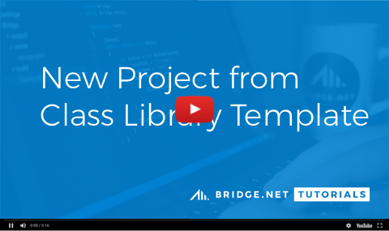
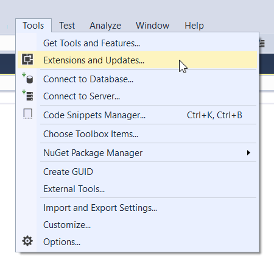
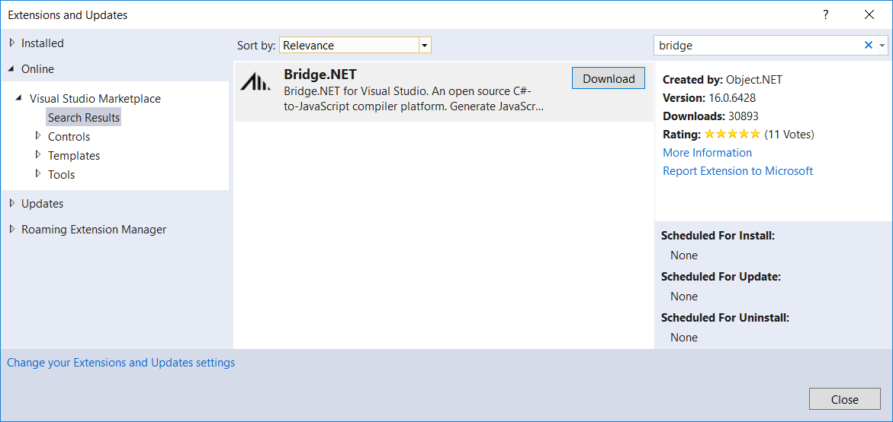

# Welcome to Bridge.NET

!!!danger
Bridge.NET is no longer under active development. :cry:

We have a plan sketched out for a complete ground up reimplementation of Bridge, so we hope to pick things up again at some point in the future.
!!!


**Bridge.NET** is an open source C#-to-JavaScript Compiler. Write your application in C# and run on billions of devices.

||| C#
```csharp Write C# and compile with Bridge.NET
public class Program
{
    public static void Main()
    {
        var msg = "Hello, World!";

        Console.WriteLine(msg);
    }
}
```
||| JavaScript
```js Run in a web browser
Bridge.define("Demo.Program",
{
    main: function Main ()
    {
        var msg = "Hello, World!";

        System.Console.WriteLine(msg);
    }
});
```
|||

Run the sample above at [Deck.NET](https://deck.net/helloworld).

## TL;DR

* Read the [Getting Started](introduction/Getting_Started.md) Knowledge Base article
* Try [Deck.NET](https://deck.net/) if you want to play
* Installation:
  * Add **Bridge.NET** Visual Studio extension, or
  * Use [NuGet](https://www.nuget.org/packages/bridge) to install into a C# Class Library project (`Install-Package Bridge`), or
* The [Attribute Reference](attributes/Attribute_Reference.md) documentation is important
* The [Global Configuration](introduction/Global_Configuration.md) documentation is important
* Licensed under [Apache License, Version 2.0](https://github.com/bridgedotnet/Bridge/blob/master/LICENSE.md)
* Need Help? Bridge.NET [Forums](https://forums.bridge.net/) or GitHub [Issues](https://github.com/bridgedotnet/Bridge/issues)
* [@bridgedotnet](https://twitter.com/bridgedotnet) on Twitter

## Getting Started

If you are new to Bridge, a great place to start is reviewing the [Getting Started](introduction/Getting_Started.md) guide.

The easiest place to see Bridge in action is [Deck.NET](https://deck.net/).

[](https://www.youtube.com/watch?v=cEUR1UthE2c)

## Sample

The following code sample demonstrates a simple `App.cs` class that will run automatically on page load and write a message to the Bridge Console.

```csharp Example ([Deck.NET](https://deck.net/7fb39e336182bea04c695ab43379cd8c))
public class Program
{
    public static void Main()
    {
        Console.WriteLine("Hello World!");
    }
}
```

The C# class above will be compiled into JavaScript and added to `/Bridge/ouput/demo.js` within your project. By default, Bridge will use the Namespace name as the file name. In this case: `demo.js`. There are many options to control the output of your JavaScript files, and the [Attribute Reference](attributes/Attribute_Reference.md) is important documentation to review.

```javascript
Bridge.define("Demo.Program", {
    main: function Main() {
        System.Console.WriteLine("Hello World!");
    }
});
```

## Installation

A full list of installation options available at [https://bridge.net/download](https://bridge.net/download/), including full support for Visual Studio and Visual Studio Community on Windows, and Visual Studio Mac.

### Bridge for Visual Studio

If you're using Visual Studio for Windows, the easiest way to get started is by adding the Bridge.NET for Visual Studio [extension](https://visualstudiogallery.msdn.microsoft.com/dca5c80f-a0df-4944-8343-9c905db84757).

From within Visual Studio, go to the <kbd>Tools</kbd> > <kbd>Extensions and Updates...</kbd>.



From the options on the left side, be sure to select **Online**, then search for **Bridge**. Clicking **Download** will install Bridge for Visual Studio. After installation is complete, Visual Studio may require a restart.



Once installation is complete you will have a new **Bridge.NET** project type. When creating new Bridge enabled projects, select this project type.
### NuGet

Another option is installation of Bridge into a new **C# Class Library** project using [NuGet](https://www.nuget.org/packages/bridge). Within the NuGet Package Manager, search for **Bridge** and click to install.

Bridge can also be installed using the NuGet Command Line tool by running the following command:

```
Install-Package Bridge
```

More information regarding Nuget package installation for Bridge is available in the [Documentation](introduction/NuGet_Installation.md).

## Contributing

Interested in contributing to Bridge? Please see [CONTRIBUTING.md](general/Contributing.md).

We also flag some Issues as [up-for-grabs](https://github.com/bridgedotnet/Bridge/issues?q=is%3Aopen+is%3Aissue+label%3Aup-for-grabs). These are generally easy introductions to the inner workings of Bridge, and are items we just haven't had time to implement. Your help is always appreciated.

## How to Help

We need your help spreading the word about Bridge. Any of the following items will help:

1. Star the [Bridge](https://github.com/bridgedotnet/Bridge/) project on GitHub
1. Leave a review at [Visual Studio Gallery](https://marketplace.visualstudio.com/items?itemName=BridgeNET.BridgeNET)
1. Blog about Bridge.NET
1. Tweet about [@bridgedotnet](https://twitter.com/bridgedotnet)
1. Start a discussion on [Reddit](https://reddit.com/r/programming) or [Hacker News](https://news.ycombinator.com/)
1. Answer Bridge related questions on [StackOverflow](https://stackoverflow.com/questions/tagged/bridge.net)
1. Give a local usergroup presentation on Bridge
1. Give a conference talk on Bridge
1. Provide feedback ([forums](https://forums.bridge.net), [GitHub](https://github.com/bridgedotnet/Bridge/issues) or [email](mailto:hello@bridge.net))

## Testing

Bridge is continually tested with the full test runner available at [testing.bridge.net](https://testing.bridge.net/).

## Credits

Bridge is developed by the team at [Object.NET](https://object.net/). Frameworks and Tools for .NET Developers.

## License

**Apache License, Version 2.0**

Please see [LICENSE](https://github.com/bridgedotnet/Bridge/blob/master/LICENSE.md) for details.