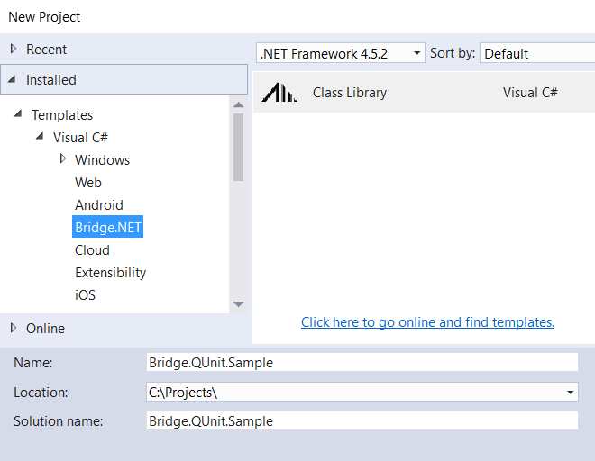
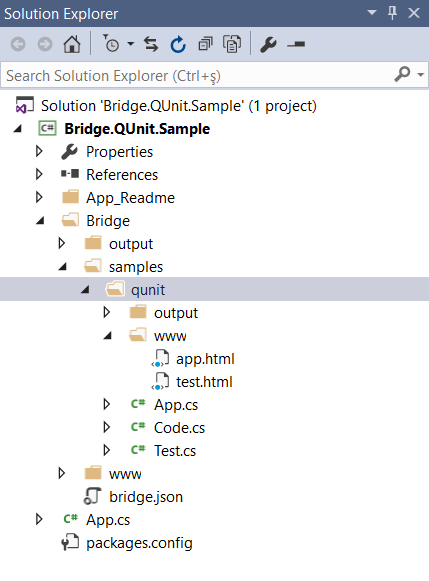
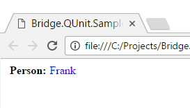
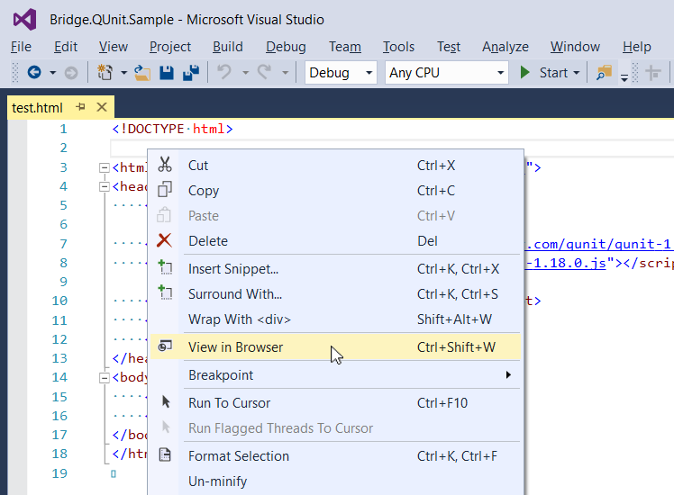
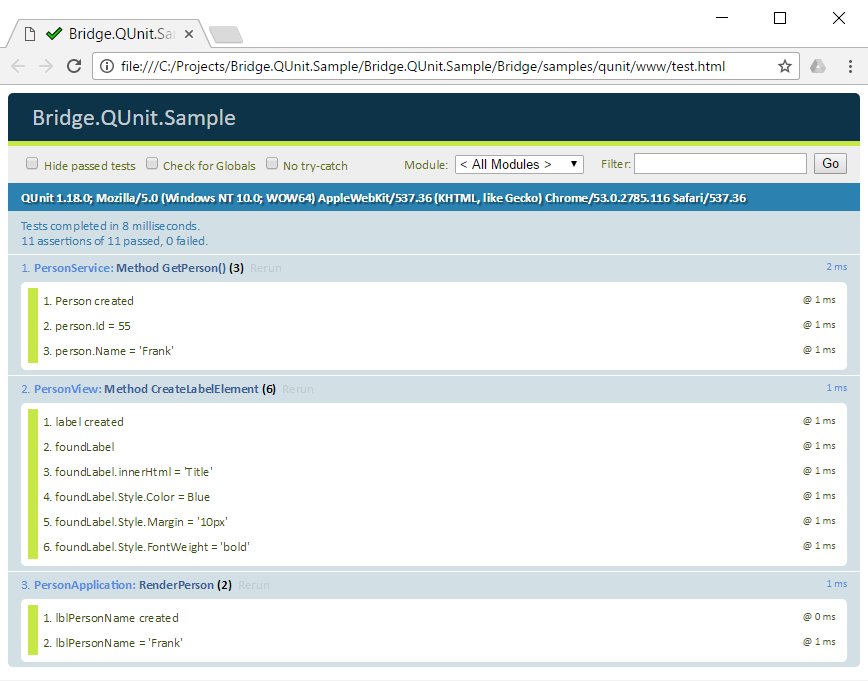

# Bridge.QUnit Sample

Writing unit tests for Bridge.NET projects with the **Bridge.QUnit Framework** is very easy especially if you are already familiar with [QUnit](https://qunitjs.com) itself since the same API is used in both cases. 

For your reference, there is great **QUnit** documentation online:

* [QUnit API Documentation](http://api.qunitjs.com/)
* [Cookbook](https://qunitjs.com/cookbook/)

## Getting Started

To start with **Bridge.QUnit**, run either of the following command within the Visual Studio NuGet Package Manager:

```
install-package Bridge.QUnit
```

```
install-package Bridge.QUnit.Sample
```

A target project may either be an existing Bridge.NET project or an empty Class Library project. Please refer to the [Getting Started](../introduction/Getting_Started.md/) Knowledge Base article to learn how to get a basic Bridge.NET project started. 

The table below shows what gets installed by the packages.

| Bridge.QUnit | Bridge.QUnit.Sample |
| --- | --- |
| References to **Bridge**, **Bridge.Html5** and **Bridge.QUnit** assemblies | References to **Bridge**, **Bridge.Html5** and **Bridge.QUnit** assemblies |
| **Bridge** folder | **Bridge** folder |
| **App_Readme** folder | **App_Readme** folder |
| | **Bridge\samples\qunit** folder |
| | C# sample class (`Code.cs`) |
| | C# unit test class (`Test.cs`) |
| | HTML page to run tests and view results (`test.html`) |

## The Sample Application

Let us see how to use **Bridge.QUnit** by installing the **Bridge.QUnit.Sample** package.

In Visual Studio, create a new **Bridge.NET** project (you can download the VS extention at [Bridge.NET for Visual Studio](https://visualstudiogallery.msdn.microsoft.com/dca5c80f-a0df-4944-8343-9c905db84757)).



Install **Bridge.QUnit.Sample** by running the following command on the Package Manager Console (the screenshot shows the resulting project structure).

```
PM> Install-Package Bridge.QUnit.Sample
```


 
The sample application implements a very simple test case scenario: An instance of type **Person** is created and the value of its `Name` property is shown in a web page.



You will find `App.cs` installed along with the rest of the files described in the table above. This is the actual implementation of the sample application and it is not directly related to unit testing. You can view the assorted `app.html` in your browser if you want to see the output of the sample application. It is important to note that the same code is running just without being unit tested.

## Prepare Your Code For Unit Testing

Generally speaking, C# code needs to be structured in a way suitable for unit testing. This does not apply only to Bridge.NET or QUnit and presenting good practices for producing testable code is beyond the scope of this article. Nevertheless, our sample demonstrates how to make your code unit test friendly. Having said that, we define the **PersonService** service class which will provide us with a new **Person** object to work with.

```csharp
public class PersonService
{
    public Person GetPerson(int personId)
    {
        return new Person
        {
            Id = personId,
            Name = "Frank"
        };
    }
}
```

It is always good to have the presentation separated from the data. The **PersonView** class is responsible for creating the DOM elements to output object data into. The `root` parameter of the constructor is the HTML5 element on the web page where all other, dynamically created elements will be appended to.

```csharp
public class PersonView
{
    public Element Root { get; private set; }

    public PersonView(Element root)
    {
        this.Root = root;
    }

    public LabelElement CreateLabelElement(string id, string title, 
                        string margin, bool isBold, HTMLColor color)
    {
        return new LabelElement()
        {
            Id = id,
            InnerHTML = title,
            Style =
            {
                Margin = margin ?? string.Empty,
                FontWeight = isBold ? "bold" : string.Empty,
                Color = color
            }
        };
    }

    public void CreatePersonUIElements(Person person)
    {
        this.Root.AppendChild(
          this.CreateLabelElement(null, "Person:", "5px", true, HTMLColor.Black)
        );

        this.Root.AppendChild(
          this.CreateLabelElement("lblPersonName", person.Name, null, false, HTMLColor.Blue)
        );
    }
}
```

In real world scenarios we can utilize all C# power and productivity to mock up the services and views, for example, by using **Interfaces** and **Generic<>**.

## Prepare The Tests

Right, the code is ready to be unit tested. Let's just test it, then!

In `Test.cs` we reference the required namespaces. The **RunTests** method is where test calls are made. Please note that the method is decorated with the `[Ready]` attribute to have it automatically executed once the JavaScript is loaded. See the [App Initialization](app-initialization/) article for details.

```csharp
using System;
using Bridge;
using Bridge.Html5;
using Bridge.QUnit;

namespace BridgeQUnitSample
{
    [FileName("../samples/qunit/output/test.js")]
    public class Test
    {
        [Ready]
        public static void RunTests()
        {
        }
    }
}
```

## Create The Tests

We will create two test groups for the **PersonService** and **PersonView** classes by using **QUnit.Module**.  Please note that such grouping is optional but **very useful** in real projects where a lot of tests are involved. Running a test is done by calling the **QUnit.Test** method.

```csharp
QUnit.Module("PersonService");

QUnit.Test("Method GetPerson()", (assert) =>
{
    var service = Test.GetService();
    var person = service.GetPerson(55);

    assert.Expect(3);

    assert.Ok(person != null, "Person created");
    assert.DeepEqual(person.Id, 55, "person.Id = 55");
    assert.DeepEqual(person.Name, "Frank", "person.Name = 'Frank'");
});
```

First, we use a mock up service method to actually get a hold to a real service object.

```csharp
private static PersonService GetService()
{
    return new PersonService();
}
```

Then we specify how many **assertions** are expected to run within a test by calling `assert.Expect(3);`. If the number of assertions run does not match the expected count, the test will fail. Finally, we just check the data by specifying the desired assertions based on our requirements.

!!!
You will find a third test group in `Test.cs`. It demonstrates how you can test the **RenderPerson** method of the **PersonApplication** class, which encapsulates the implementation of the sample application and is also used in `App.cs`
!!!

According to good programming style we will try to keep our tests as granular as possible. But what if we need a test fifty lines of code. Let's compare the following snippets:

```csharp
public static void RunTests()
{
     QUnit.Test("Test1", (assert) =>
     {
         assert.Expect(1);
         assert.DeepEqual(1 == 1, "1 == 1");
     });
}


```

```csharp
public static void RunTests()
{
     QUnit.Test("Test1", Test.Test1);
});

private static void Test1(Assert assert)
{
     assert.Expect(1);
     assert.DeepEqual(1 == 1, "1 == 1");
}
```

## DOM Testing Requirements

To run DOM related tests you should only rely on the **fixture markup**, inside the **#qunit-fixture** element since relying on anything else can have side effects. QUnit automatically cleans **qunit-fixture** after each test. Please note that `var view = GetView();` will return a view with `#qunit-fixture` as its root element.

```csharp
public static void RunTests()
{
    QUnit.Module("PersonView");
    QUnit.Test("Method CreateLabelElement", Test.TestCreateLabel);
});

private static void TestCreateLabel(Assert assert)
{
    assert.Expect(3);

    var view = Test.GetView();

    var label = view.CreateLabelElement("someLabel", "Title", "10px", true, HTMLColor.Blue);
    assert.Ok(label != null, "label created");

    view.Root.AppendChild(label);
    var foundLabel = Document.GetElementById<LabelElement>("someLabel");

    assert.Ok(foundLabel != null, "foundLabel");
    assert.DeepEqual(foundLabel.InnerHTML, "Title", "foundLabel.innerHtml = 'Title'");
    //Check other properties
}

private static PersonView GetView()
{
    return new PersonView(Test.EnsureTestFixture());
}
```

## Test Results

Time to build the project. The generated JavaScript files go to the `Bridge\output` folder. `test.html` contains all the required resources: 

* Bridge.NET specific: (`bridge.js` and `code.js`). For more information on generated JavaScript file names please refer to the [FileName Attribute](../attributes/Attribute_Reference.md#filename) and [Global Configuration](../introduction/Global_Configuration.md) Knowledge Base articles.
* QUnit Test specific: (`qunit-1.18.0.css`, `qunit-1.18.0.js`, the generated `test.js` and two `div` elements used as output placeholders by the tests) 

```html
<!DOCTYPE html>

<html lang="en" xmlns="http://www.w3.org/1999/xhtml">
<head>
    <title>Bridge.QUnit.Sample</title>

    <link rel="stylesheet" href="https://code.jquery.com/qunit/qunit-1.18.0.css">
    <script src="https://code.jquery.com/qunit/qunit-1.18.0.js"></script>

    <script src="../../../output/bridge.js"></script>
    <script src="../output/code.js"></script>
    <script src="../output/test.js"></script>
</head>
<body>
    <div id="qunit"></div>
    <div id="qunit-fixture"></div>
</body>
</html>
```

All you need to run the tests is to view the `test.html` web page. Right-click on the `test.html` file and select the **View in Browser** option from the pop up menu).





## Summary

Ensure sure all tests pass without errors. Since the source code changes every time your team refactors it or implements new features the value of unit testing is impossible to overestimate. It even helped us when we were developing the code of this application itself. Let's test it all out!