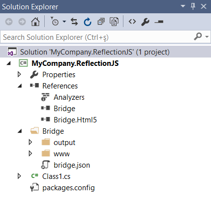
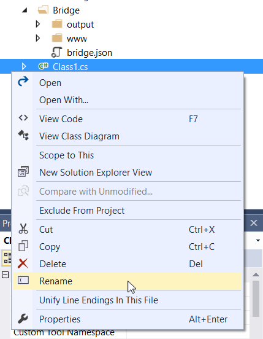
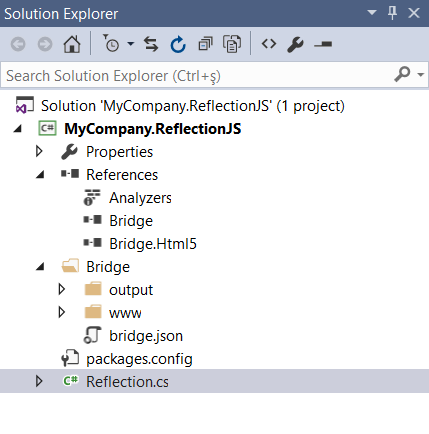
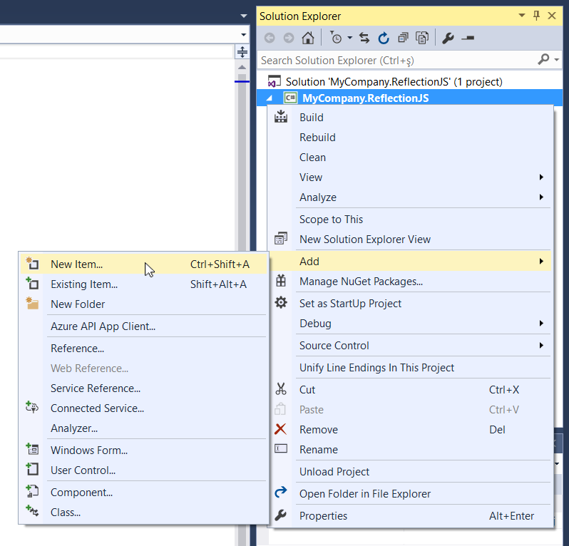
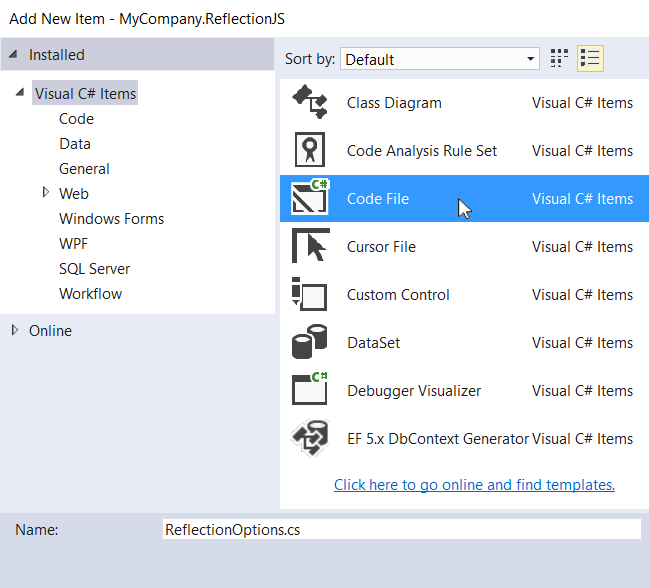
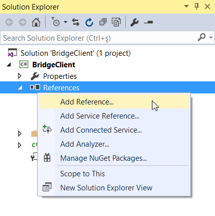
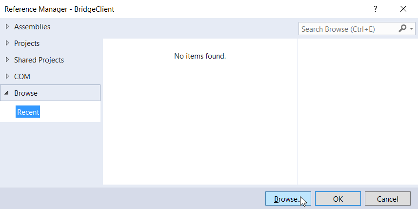
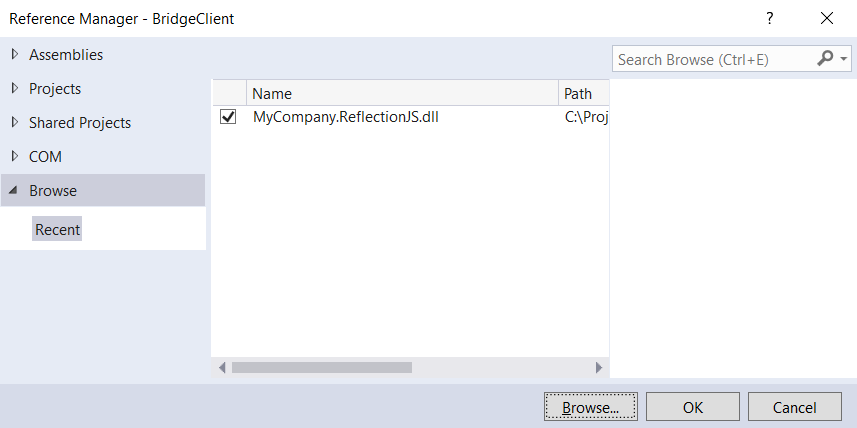
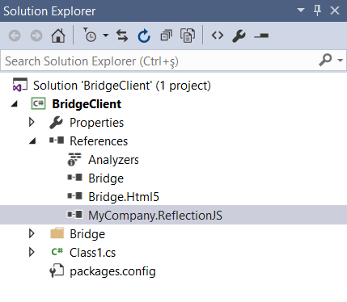
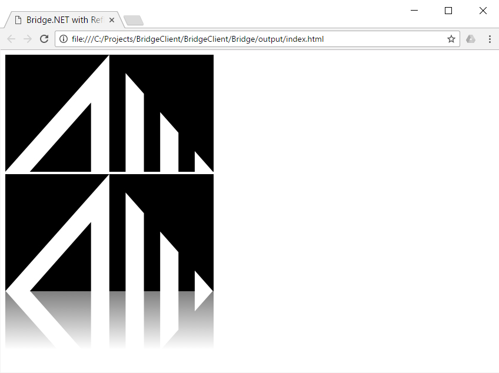

# Building A Definition Library

## Introduction

This article will guide you through creating a new Bridge.NET Definition Library. This Definition library will enable use of a JavaScript library within a C# Bridge project. For example, the **Bridge.jQuery** library is an example of a Bridge Definition library. Once **Bridge.jQuery** has been added to your Project, all the Classes, Properties, Methods, and Events of the **jQuery** JavaScript library are now available in your Bridge C# project.

The library being ported in this guide will be [Reflection.js](https://github.com/Ken-Lo/Reflection.js). This library was chosen for its simplicity and open source license availability.

This guide will cover:

* Creating a Bridge Definition Library project from scratch
* Stubbing out the library's functionality in C#
* Installing and using the library in a Bridge.NET project

## Prerequisites

* [Reflection.js](https://github.com/Ken-Lo/Reflection.js)
* Visual Studio 2013 or 2015

For the setup procedure Visual Studio 2013 (Update 4) will be used. As a web browser, we'll be using Internet Explorer 11, although any modern web browser could be used.

The sections below will step thru the process of adding support for [Reflection.js](https://github.com/Ken-Lo/Reflection.js) library to Bridge. The project will be named `MyCompany.ReflectionJS`.

## Create New Project

Create a new project. Choose between creating from Bridge's [VSIX installation](../introduction/Getting_Started.md) or [installing from NuGet](../introduction/Nuget_Installation.md). For this guide, the latter method will be used, but both should work the same.

After creating the project, the solution explorer should look like the image below:



## A Plan

Before coding can start, we need to figure out what features of `Reflection.js` are to be mapped. The following members should be defined in order to have the `Reflection.js` JavaScript API fully mapped:

```js
Reflection.add(image, options);
Reflection.remove(image);
Reflection.defaultHeight = height;
Reflection.defaultOpacity = opacity;
```

All Methods and Fields are defined on the same **Reflection** object. This object can be represented in C# as a static class, which does not need to be instantiated with `new`. This class should have two static Methods and two static Fields.

According to the `Reflection.js` documentation (accessible by opening `readme.html` inside the `Reflection.js` repository), the `image` parameter in the `add` and `remove` functions represent an HTML `` element. The Bridge types for HTML elements are defined in **Bridge.Html5**, so we need to reference that Assembly with a `using` statement within the `MyCompany.ReflectionJS` Class.

An `options` argument can be passed to the `add` function, and is an object which can contain either (or both) `height` and `opacity` fields. The type of both fields can be a floating-point number comprised between 0 and 1. This indicates that a class or struct could be defined to govern this parameter's settings.

The two fields `defaultHeight` and `defaultOpacity` are both floating point numbers varying from 0 to 1 as well.

## Main Class File

Instead of creating a new file, lets just rename the automatically created `Class1.cs` file. To do so, in the Solution Explorer, right-click on the file and select **Rename**.



Rename the file to `Reflection.cs`. Choose **yes** on the dialog that is shown when you finish renaming. The project should look like this afterwards:



The new `Reflection.cs` file will have contents similar to as shown below:

```csharp
using System;
using System.Collections.Generic;
using System.Linq;
using System.Text;

namespace MyCompany.ReflectionJS
{
    public class Reflection
    {
    }
}
```

Remove the `using` statements.

As outlined in [step 3.2](#section4) above, import the required Assembly by adding `using Bridge.Html5;` to the top of you .cs file. As a general rule, the **Bridge** Assembly should be added as well by adding `using Bridge;` to the other **using** statements. Your file should look like the following:

```csharp
using Bridge;
using Bridge.Html5;

namespace MyCompany.ReflectionJS
{
    public class Reflection
    {
    }
}
```

**Notice:** When creating new class files, **do not** create from an _Empty Class_ template. Instead, create from a _Code File_. Otherwise, Visual Studio may add back references to the non-bridge `mscorlib.dll` libraries and break your build.

## Setup Class

There are three initial requirements to consider while creating the **Reflection** class:

1. It is already defined by the underlying library
1. It is already instantiated by the underlying library
1. It is defined in the global scope

First, we want to instruct the Bridge compiler to treat the `Reflection.js` library as an **External** library. We are not defining the logic of the **Reflection** library in C#, just its API. For this, the [External](attribute-reference#External) Attribute is added to the Class.

Second, the Class, Methods and Field definitions should be _static_, so there's no need to instantiate them from C#.

Third, references to the class in JavaScript are required to be simply `Reflection` instead of `MyCompany.ReflectionJS.Reflection` -- namespace and class name path -- so the [Namespace](attribute-reference#Namespace) attribute will be configured.

For detailed information on all available Attributes, please refer to the [Bridge.NET attributes reference article](attribute-reference). Visual Studio's IntelliSense also helps with discovering and completing the Attribute parameters.

After applying both Attributes, the resulting `Reflection.cs` file will be:

```csharp
using Bridge;
using Bridge.Html5;

namespace MyCompany.ReflectionJS
{
    [External]
    [Namespace(false)]
    public static class Reflection
    {
    }
}
```

## Fields and Methods

Now the Fields and Methods pertaining the **Reflection** class are to be configured. As noted in [step 6](#section6), they are declared as `static` because they are available without the need to instantiate the `Reflection` class (which, in turn, is also static).

Reviewing the `Reflection.js` documentation (refer to [step 3.2's planning](#section4)), both Fields best fit a **floating-point** value, or an expression which result pertains to this type. We can then define as follows:

```csharp
public static float DefaultHeight;
public static float DefaultOpacity;
```

Notice the variables were defined using UpperCamelCase syntax (`DefaultHeight`, `DefaultOpacity`). 

Following C# and JavaScript naming conventions, Bridge.NET will automatically compile C# Method and Field names to their correct **lowerCamelCase** names. Using the sample above, `DefaultHeight` configured in C# will be automatically compiled into `defaultHeight` in JavaScript code.

Moving forward to the Method definitions, looking again to the `Reflection.js` documentation ([step 3.2's planning](#section4)) both methods on the class do not have a return value. Their declaration will have a `void` return type. At first, the `options` parameter may be defined as `object` so one can use either an anonymous object or a strongly-typed class to provide the parameter's value.

Defining the Methods would then look like:

```csharp
public static void Add(ImageElement image, object options)
{
    return;
}

public static void Remove(ImageElement image)
{
    return;
}
```

Notice each method have is a `return;` call in its body. In fact, for the `void` methods, just an empty function would suffice. Remember in this Library, the **Reflection** class and all it's Members, will not be compiled by Bridge into a `.js`. We're only concerned that the **Reflection** Class and it's Members are available in C# to be called from other C# Bridge projects. In this case, the body of the Member is not required. The logic is defined in JavaScript within `Reflection.js` and all we're concerned with is the Member signature.

If the Method has a return type, you can just return the type's default value. The following sample demonstrates:

```csharp
public static MyType MyMethod()
{
    return default(MyType);
}
```

The resulting `Reflection.cs` file should have the following contents after the stubbed entities are configured:

```csharp
using Bridge;
using Bridge.Html5;

namespace MyCompany.ReflectionJS
{
    [External]
    [Namespace(false)]
    public static class Reflection
    {
        public static float DefaultHeight;
        public static float DefaultOpacity;

        public static void Add(ImageElement image, object options)
        {
            return;
        }

        public static void Remove(ImageElement image)
        {
            return;
        }
    }
}
```

When you are defining your library, do not refrain from using the `///` C# comment blocks. This documentation feeds IntelliSense data which assists users of your Bridge.NET Definition Library. For example, the `Reflection.Remove()` method could be enhanced by adding documentation:

```csharp
        /// <summary>
        /// Removes the reflection effect from the specified Image Element.
        /// </summary>
        /// <param name="image">The image element to remove the effect from.</param>
        public static void Remove(ImageElement image)
        {
            return;
        }
```

## Parameter Types

The `Reflection.js` library support should now be fully functional.

But, we should be able to improve the usability of this library. There are a couple refinements we can easily make to improve the developer experience. 

First, when using the `Add` Method, currently developers have to guess what `options` to pass. The `options` parameter is not a strongly typed object. To address this, the `options` parameter can be changed to reflect a well-defined class instead of a general purpose `object`.

Second, unused class fields can still be omitted from the call if they are not assigned to values. For example, we may want to pass a `height` parameter, but not an `opacity`. This behaviour can be achieved with use of the [ObjectLiteral](attribute-reference#ObjectLiteral) attribute to decorate the class.

Lets define a new class called **ReflectionOptions**, and add this to a dedicated .cs file. 

Create the file and add to the solution. Do not create the class using the `Class` or `New Class` file template, but the empty `Code file`, otherwise undesired system references will be added to the project. The file will be named `ReflectionOptions.cs`.





The newly created file will be empty, and three important sections must be written to it:

1. The `using` statement(s)
1. The `namespace` block
1. The `class` block

The resulting file should look like this:

```csharp
using Bridge;

namespace MyCompany.ReflectionJS
{
    public class ReflectionOptions
    {
    }
}
```

Next we'll add the Attributes as specified above. The resulting file should look like the following sample:

```csharp
using Bridge;

namespace MyCompany.ReflectionJS
{
    [External]
    [ObjectLiteral]
    public class ReflectionOptions
    {
        public float Height;
        public float Opacity;
    }
}
```

Notice the **ReflectionOptions** class is not declared as `static` as this is a normal class that should be instantiated with `new` from C#.

Back to the main class within `Reflection.cs`, we need to update the type of `options` to our new **ReflectionOptions** class.

```csharp
using Bridge;
using Bridge.Html5;

namespace MyCompany.ReflectionJS
{
    [External]
    [Namespace(false)]
    public static class Reflection
    {
        public static float DefaultHeight;
        public static float DefaultOpacity;

        public static void Add(ImageElement image, ReflectionOptions options)
        {
            return;
        }

        public static void Remove(ImageElement image)
        {
            return;
        }
    }
}
```

At this point the library support is ready to be compiled and deployed to Bridge.NET projects.

There are several appendices to this guide, briefly covering side tasks related to the building, improving and finishing of the library framework support. [Section 4](#section4) will be dedicated for the deployment of our new **Reflection** library and some usage examples.

## Deploy And Referencing

After the library has compiled correctly on your IDE (may it be Visual Studio as used in this example, Visual Studio Code, Xamarin Studio or Mono Develop or even msbuild/xbuild directly), it is time to test it in action. For that, the library files must be referenced by a Bridge.NET client project.

## Client Application

Consider a _Bridge client project_ as a C# Class Library application where C# code is written with the purpose of being compiled into JavaScript. In other words, an application that references Bridge.NET, optional frameworks and uses Bridge.NET's compiler during its own build process to output corresponding JavaScript files.

To get a Bridge client application project working, the two easiest options are following either the [Getting Started](getting-started) or the [NuGet Installation](nuget-installation) knowledge base articles.

After the project is set up, the **MyCompany.ReflectionJS** framework must be referenced. The client project will be called **BridgeClient**. It has been created as a separate solution in the same directory where the **MyCompany.ReflectionJS** solution were created, following the [NuGet Installation](nuget-installation) knowledge base article setup procedure.

To add the Reference, right-click the project's **References** folder, then browse for the `MyCompany.ReflectionJS.dll` library inside the **MyCompany.ReflectionJS** project dir, or **MyCompany.ReflectionJS/MyCompany.ReflectionJS/bin/Debug**:





If you don't see the DLL file there, the framework project might have been built in the **Release** configuration. If so, just look for it inside **MyCompany.ReflectionJS/MyCompany.ReflectionJS/bin/Release**. If still not, the project was probably not built at all. Double check if the Build process was completed correctly.

Once the DLL file is selected, it should show in the references dialog with a checked checkbox next, as depicted below:



Click 'Ok' and it should display the result below, in the Bridge.NET client solution:



From this point, the library can be used in code.

## Application Example

First create a simple HTML page to. Create the file below inside the project's **Bridge/output/** directory.

```html
<!DOCTYPE html>

<html lang="en" xmlns="http://www.w3.org/1999/xhtml">
vhead>
    <meta charset="utf-8" />
    <title>Bridge.NET with Reflection.js</title>
    <script src="bridge.js"></script>
    <script src="BridgeClient.js"></script>
    <script src="reflection.js"></script>
</head>
<body>
    
    
</body>
</html>
```

Copy the **reflection.js,** file to the same directory where the `index.html` file is located. The file can be downloaded directly from [this link](https://github.com/Ken-Lo/Reflection.js/raw/master/reflection.js).

Remember to create the file below following the guidelines of [step 8](#section8) (or renaming `Class1.cs` like [step 3](#section5)).

```csharp
using Bridge.Html5;
using MyCompany.ReflectionJS;

namespace BridgeClient
{
    public class Driver
    {
        public static void Main()
        {
            var image = Document.GetElementById<ImageElement>("MyPic");
            var options = new ReflectionOptions
            {
                Height = 1/4
            };

            Reflection.Add(image, options);
        }
    }
}
```

Build your Bridge.NET client project and view the `index.html` file in a browser. The result should look like this:



The page will render with the original picture above and then the same image below with the reflection applied.

## Summary

This article provides a simple understanding of the process required to build a Bridge Definition Library. In general, the main challenge while building a definition library would be deciding on an approach for mapping the JavaScript library API to an equivalent C# counterpart, but also leveraging the power of C# types.

Whether it should be a class or a method, private or public, static, a type or an enumerator, it is up to the developer to infer what best matches in each case. The less dynamically-typed the library can be represented, the better usability in C#.