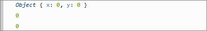
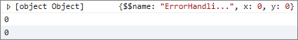

# Exceptions And Debugging

The console window of the browser is always a handy tool when it comes to debugging JavaScript code. You can use `Console.WriteLine` in your C# code to output information to the Bridge Console, such as **Exception** details.

## Console Class

Bridge defines the **Console** class in the **System** namespace. 

### Console.WriteLine and Console.WriteLine

The following demonstrates usage of `Console.WriteLine`.

```csharp
using System;
using Bridge;

namespace ErrorHandling
{
    public struct Point
    {
        public int X, Y;
    }

    public class MyClass
    {   
        public static void Main()
        {
            Point p = new Point();
            Console.WriteLine(p);
        }
    }
}
```

The following figures show the resulting output in the console window of Firefox and IE respectively:





#### To Open The Console:

Browser | Command
--- | ---
Firefox | <kbd>Ctrl</kbd>+<kbd>Shift</kbd>+<kbd>K</kbd>
Firebug | <kbd>F12</kbd>
Chrome | <kbd>Ctrl</kbd>+<kbd>Shift</kbd>+<kbd>I</kbd>
Internet Explorer | <kbd>Ctrl</kbd>+<kbd>Shift</kbd>+<kbd>I</kbd>

Note, that both method calls are translated to `console.log`, ultimately.

```js
var p = new ErrorHandling.Point();
console.log(p.$clone());
console.log(p.x);
console.log(p.y);
```

### Exception Handling

**Console** can be used in exception handling, for example:

```csharp
using System;
using Bridge;
using Bridge.Html5;

namespace ErrorHandling
{
    public struct Point
    {
        public int X, Y;
    }

    public class MyClass
    {   
        public static void Main()
        {
            Point[] points = new Point[1000];
            try
            {
                int x = points[500].X;
                Console.WriteLine(x);
            }
            catch (Exception e)
            {
                Console.WriteLine("ERROR: " + e);
            }
        }
    }
}
```

Results in `ERROR: points[500] is undefined` to be displayed in the Bridge Console and the browser Developer Tools console.

### Accept User Input

There are cases where you need to prompt the user to input some value. `Console.Read` and `Console.ReadLine` do just that by popping up a JavaScript dialog box (they are both translated to the familiar `prompt` JavaScript function). The latter can optionally accept a prompt message and a default value as parameters. Here is how the code example above can be modified to let the user enter the index of the `points` array ("500" is cleverly set as the default input value since `points[500]` is the only instantiated array element):

```csharp
using System;
using Bridge;
using Bridge.Html5;

namespace ErrorHandling
{
    public struct Point
    {
        public int X, Y;
    }

    public class MyClass
    {   
        public static void Main()
        {
            Point[] points = new Point[1000];
            points[500] = new Point();
            points[500].X = 500;
            points[500].Y = 500;
            try
            {
                int index = Int32.Parse(Console.ReadLine("Enter index value", "500"));
                Console.WriteLine(points[index].X);
                Console.WriteLine(points[index].Y);
            }
            catch (Exception e)
            {
                Console.WriteLine("ERROR: " + e);
            }
        }

    }
}
```