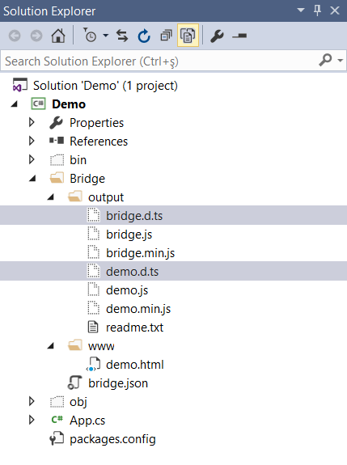
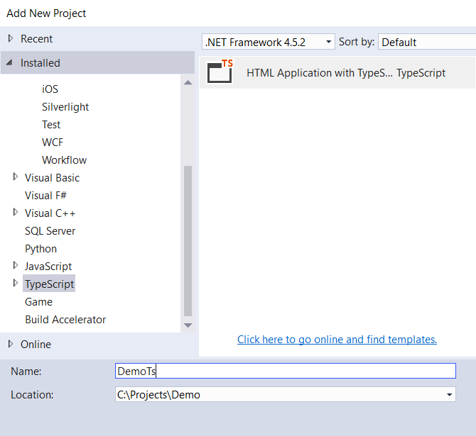
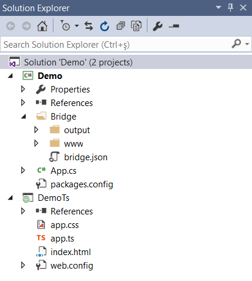
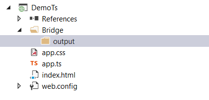
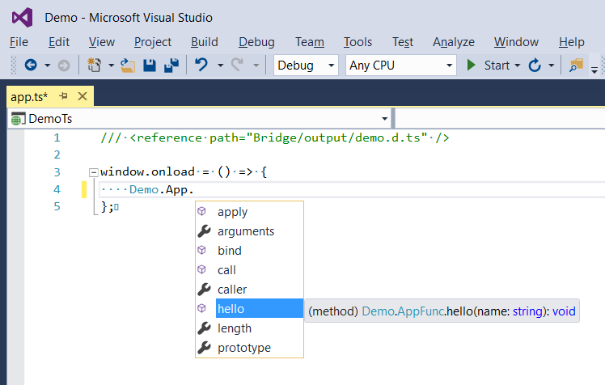
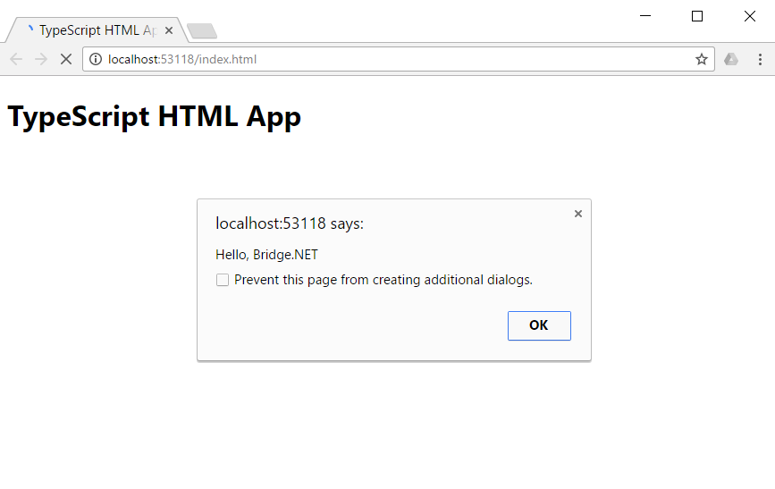

# Generate TypeScript Definitions

Bridge supports the generation of [TypeScript](https://www.typescriptlang.org/) definitions for C# types. 

In this article, you learn how to instruct the Bridge compiler to emit [**.d.ts**](https://www.typescriptlang.org/Handbook#writing-dts-files) alongside the matching `.js` files and use them in a Visual Studio TypeScript project.

## Create A Bridge Project

**Step 1:** In Visual Studio, create a new Bridge Class Library project. The process is described step by step in our [Getting Started](../introduction/Getting_Started/) article.

**Step 2:** Modify the Bridge configuration to enable generation of TypeScript definitions. Open `Bridge/bridge.json` and edit it to look like below. TypeScript support is enabled simply by setting the new **generateTypeScript** configuration property to **true**.

```js
{
    "output": "Bridge/output",
    "generateTypeScript": true
}
```

**Step 3:** Also, modify `App.cs` to better suit the purpose of this article. An entry point to the Bridge application is not needed, so here's how the code should look like.

```csharp
using Bridge;
using Bridge.Html5;

namespace Demo
{
    public class App
    {
        public static void Hello(string name)
        {
            Global.Alert(string.Format("Hello, {0}", name));
        }
    }
}
```

**Step 4:** In Solution Explorer, right click the project and select **Rebuild**. Click the Show All Files button on the Solution Explorer toolbar to unveil hidden files. The screenshot below shows the content of the `Bridge\output` folder after the Bridge project has been successfully built.



The following table describes the generated `.d.ts` files.

d.ts | Description
--- | ---
`demo.d.ts` | The TypeScript definition that matches the project's generated JavaScript. The file is named after the project name, by default.
`bridge.d.ts` | The TypeScript definition for the main Bridge JavaScript file (`bridge.js`). This file is referenced inside `demo.d.ts`.

## The TypeScript Project

Add a new TypeScript project to the **Demo** solution by right clicking on it in the Solution Explorer and select **Add** > **New Project**. To find the **HTML Application with TypeScript** template, click **Installed** > **Other Languages** > **TypeScript**. Name the project **DemoTs** and click **OK**.

Depending on your Visual Studio installation, the TypeScript project template may not be available. In this case, you need to install TypeScript for Visual Studio [2013](https://visualstudiogallery.msdn.microsoft.com/107f89a0-a542-4264-b0a9-eb91037cf7af) or [2015](https://visualstudiogallery.msdn.microsoft.com/3e5ba71c-abea-4d00-b81b-a62de3ad3d53). Visit the [TypeScript web site](https://www.typescriptlang.org/) for more information on all supported TypeScript editors.



The below screenshot shows what the **Demo** solution should look like at this point.



## Combine The Two Projects

The TypeScript project needs to use the output files of the Bridge class library project, so let's combine the two projects. In Solution Explorer, right click on **DemoTs** and select **Add** > **New Folder**. Name the folder **Bridge**. Right click on the **Bridge** folder and repeat to add a new folder named **output**. The resulting project structure is shown in the following screenshot.



In the Bridge project, open `Bridge/bridge.json` and change the value of the **output** configuration property as follows.

```js
{
    "output": "../DemoTs/Bridge/output",
    "generateTypeScript": true
}
```

Right click the Bridge project and select **Rebuild**. This time, the output files are located in the `Bridge\output` folder of the **DemoTs** project. Don't forget to click the Show All Files button on the Solution Explorer toolbar to view them.

## Use The TypeScript Definitions

In the TypeScript project, edit **App.ts** to reference the **Bridge\output\demo.d.ts** definition file and make a call to the static **Demo.App.hello** method. 

```js
/// <reference path="Bridge/output/demo.d.ts" />

window.onload = () => {
    Demo.App.hello("Bridge.NET");    
};
```

IntelliSense is available as you type.



Open `index.html` to add references to the JavaScript files generated by the Bridge compiler. 

```html
<!DOCTYPE html>

<html lang="en">
<head>
    <meta charset="utf-8" />
    <title>TypeScript Bridge App</title>
    <link rel="stylesheet" href="app.css" type="text/css" />

    <script src="Bridge/output/bridge.js"></script>
    <script src="Bridge/output/demo.js"></script>
    <script src="app.js"></script>
</head>
<body>
    <h1>TypeScript Bridge App</h1>

    <div id="content"></div>
</body>
</html>
```

Click the Start Debugging button or press <kbd>F5</kbd> to build and run the TypeScript project.The result is shown in the following screenshot.



## Next Step

Related information you may be interested in after reading this article:

* [The Bridge v1.7 release blog post](https://bridge.net/bridge-v1-7-released/)
* [The official TypeScript web site](https://www.typescriptlang.org/)
* [A guide on how to write **.d.ts** files](https://www.typescriptlang.org/Handbook#writing-dts-files)