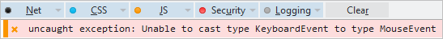

# Type Casting

Bridge supports multiple forms of C# type casting in JavaScript and using type casting ensures code is checked for type compliance.

Let us take a look at how we can use type casting and inspect the generated JavaScript. We can create a simple project with one input field added to the form and a listener to handle key press event. In the **InputKeyPress** method handler you can find type conversion examples with corresponding JavaScript code in comments.

```csharp Example ([Deck.NET](https://deck.net/f8bdfb1de16de4bf67ce9468994a764c))
using System;
using Bridge;
using Bridge.Html5;

namespace Html5Demo
{
    class TypeCasting
    {
        public static void Main()
        {
            var input = new Bridge.Html5.HTMLInputElement() 
            { 
                Id = "number",
                Type = InputType.Text
            };

            input.AddEventListener(EventType.KeyPress, InputKeyPress);

            Document.Body.AppendChild(input);
        }

        private static void InputKeyPress(Event e)
        {
            // e will be successfully cast into KeyboardEvent
            var a = (KeyboardEvent)e;
            // var a = Bridge.cast(e, KeyboardEvent);


            // e will be successfully cast into KeyboardEvent
            var b = e as KeyboardEvent;
            // var b = Bridge.as(e, KeyboardEvent);

            // e will be successfully cast into KeyboardEvent.
            // No cast here is required
            var c = e.As<KeyboardEvent>();
            // var c = e;
 
            // e will be successfully cast into Object
            var d = e as Object;
            // var d = Bridge.as(e, Object);

            // g will result in null as d is not an InputElement
            var g = d as HTMLInputElement;
            // var g = Bridge.as(d, HTMLInputElement);

            // The line below will throw an Exception:
            // 'Unable to cast type KeyboardEvent to type HTMLInputElement'
            var h = (HTMLInputElement)d;        
            // var h = Bridge.cast(d, HTMLInputElement);

            // This demonstrates how to get a KeyCode from the Event. 
            // No cast is written as we use .As()
            if (e.As<KeyboardEvent>().KeyCode == 13)
            {
                // Do some work here
            }
            // if (e.keyCode === 13)
        }
    }
}
```


```js
Bridge.define("Html5Demo.TypeCasting", {
    main: function Main() {
        var $t;
        var input = ($t=document.createElement('input'), $t.id = "number", $t.type = "text", $t);

        input.addEventListener("keypress", Html5Demo.TypeCasting.InputKeyPress);

        document.body.appendChild(input);
    },
    statics: {
        methods: {
            InputKeyPress: function (e) {
                // e will be successfully cast into KeyboardEvent
                var a = Bridge.cast(e, KeyboardEvent);
                // var a = Bridge.cast(e, KeyboardEvent);


                // e will be successfully cast into KeyboardEvent
                var b = Bridge.as(e, KeyboardEvent);
                // var b = Bridge.as(e, KeyboardEvent);

                // e will be successfully cast into KeyboardEvent.
                // No cast here is required
                var c = e;
                // var c = e;

                // e will be successfully cast into Object
                var d = e;
                // var d = Bridge.as(e, Object);

                // g will result in null as d is not an InputElement
                var g = Bridge.as(d, HTMLInputElement);
                // var g = Bridge.as(d, HTMLInputElement);

                // The line below will throw an Exception:
                // 'Unable to cast type KeyboardEvent to type HTMLInputElement'
                var h = Bridge.cast(d, HTMLInputElement);
                // var h = Bridge.cast(d, HTMLInputElement);

                // This demonstrates how to get a KeyCode from the Event. 
                // No cast is written as we use .As()
                if (e.keyCode === 13) {
                    // Do some work here
                }
                // if (e.keyCode === 13)
            }
        }
    }
});
```

Please note, using `var c = e.As<KeyboardEvent>()` in C# results in `var c = e` JavaScript code. If you are sure of the types and the conversion then you can use the generic method `.As<T>()` to optimise your application performance and prevent redundant code from being generated.

## Direct Cast vs. The As Keyword

So, what is the difference between a direct cast and using the **as** keyword? 

If you use the debugger of your browser you will find that **Bridge.cast** calls **Bridge.as**, which in turn results in a call to the **Bridge.is** function. 

The catch is that in case of error, **Bridge.cast** throws a **InvalidCastException** exception with a descriptive error message while **Bridge.as** returns **null**. This is in full accordance with how C# behaves. Based on the above example, the result of the following invalid cast is shown in the screenshot below:

```csharp
var a = (MouseEvent)e;
//var a = Bridge.cast(e, KeyboardEvent); 
```



It is good practice to always check for **null** after an **as** expression.

```csharp
var b = e as MouseEvent;

if (b != null)
{
    Console.WriteLine(b);
}
```