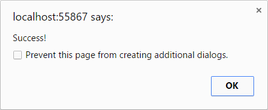
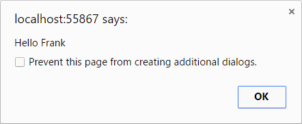

# Using external JavaScript

What happens if you want to call external JavaScript code within your Bridge project?

The initial release of Bridge includes binding frameworks for native JavaScript, jQuery and Bootstrap, but you certainly do not have to wait for your library to be adapted into C# to start using that code in a Bridge project.

!!!
If you're new to Bridge.NET, be sure to first check out our [Getting Started](../introduction/Getting_Started.md) guide.
!!!

## Setup

First off, let's set up a basic scenario:

You have an existing web application, and that app includes a JavaScript file with some custom functions. For now you would like to leave the existing `.js` file untouched, but within your Bridge project you still must be able to call a function within that legacy code.

Let's create a simple JavaScript file to represent our legacy code. In the sample below, we have one simple `subject` variable, a simple `notify` function that triggers an alert to popup with a custom message, and finally a second `getUser` function that returns a simple **User** configuration object.

Remember, this represents our **old** JavaScript code that we do not want to change, but we still need to **use** this code.

```js
var subject = "Testing";

var notify = function (message) {
	alert(message);
};

var getUser = function () {
	var user = {
		id: 55,
		name: 'Frank'
	};

	return user;
};
```

While we're at it, let's create a very simple .html page to test with, and to represent the very basic structure of an existing web application.

```html
<!DOCTYPE html>

<html>
<head>
    <title>My Demo App</title>
    <script src="legacy.js"></script>
</head>
<body>

</body>
</html>
```

You should turn off the .html generation because the Bridge compiler will overwrite the file on each new build. Within your projects `bridge.json` file, please add the following `html` section:

```json
{
    "html": {
        "disabled": true
    }
}
```

At this point, opening this html page in a web browser does nothing and the page is blank. The goal now is to call the `notify` function from our C# Bridge project.

You have options, so let's step through a few scenarios.

To get things started, let's create a simple `App.cs` file to represent the beginning of our new Bridge.NET powered web application.

```csharp
using Bridge;
using Bridge.Html5;

namespace Demo
{
    public class App
    {
        public static void Main()
        {
            // How to call notify()?
        }
    }
}
```

Build your project (<kbd>F6</kbd>) and a new `demo.js` file will be generated. Let's include `demo.js` and the required `bridge.js` files into our `demo.html` page, at which point we have all the pieces in place.

```html
<!DOCTYPE html>

<html>
<head>
    <title>My Demo App</title>
    <script src="legacy.js"></script>
    <script src="bridge.js"></script>
    <script src="demo.js"></script>
</head>
<body>

</body>
</html>
```

Refresh the page in the web browser, and it should still be blank, but we are making progress.

## Script.Call

If you ever just want to call an external JavaScript function, the easiest option is `Script.Call()`. Actually it's so easy it's almost cheating.

```csharp
public static void Main()
{
    Script.Call("notify", "Success!");
}
```

Refresh the `demo.html` page in the browser, and you should see the **"Success!"** message popup. The `notify` function has been automatically called when the page loads, and an alert message has been fired.



Notice the second parameter configured on `Script.Call` is `"Success!"`, which is passed directly to the `notify` function as a parameter.

Let's take a look at `demo.js` to see what Bridge generated.

```js
Bridge.define('Demo.App', {
    statics: {
        config: {
            init: function () {
                Bridge.ready(this.main);
            }
        },
        main: function () {
            notify("Success!");
        }
    }
});
```

You can see our custom `Script.Call` code on Line #9 which has been translated into a clean `notify('Success!')` call.

At this point we've accomplished our basic goal of calling external JavaScript code from within our C# Bridge project, but let's keep rolling and elaborate on some other options.

## Dynamic Script.Call

Our second legacy function is `getUser()`, which returns a simple **user** configuration object. You could think of our first `Script.Call` usage similar to calling a C# `void` Method, or a Method without a return type.

Script.Call also makes use of C# Generics and can intelligently return a C# type. Let's call our legacy `getUser` function, then notify the `name` property.

```csharp Example
public static void Main()
{
    var user = Script.Call<dynamic>("getUser");

    // Use of dynamic types to get a property
    SayHello(user.name);
}

public static void SayHello (string message)
{
    Script.Call("notify", "Hello " + message);
}
```

Build your application and refresh `demo.html`. You should see an alert popup with **"Hello Frank"** as the message.



Using the C# `dynamic` type allows your code to bypass the compile time checking within Visual Studio. Basically this just means if you use `dynamic`, the compiler effectively **trusts** the dynamic code is valid.

The use of **dynamic** types in C# provide flexibility, although we do lose Intellisense and compile time checking of those types.

You can also see in the sample above that we created a new dedicated `SayHello` Method in C# to encapsulate the `notify` call.

Let's continue to build upon our sample by configuring a custom **User** class and then returning that type from `Script.Call` instead of using a **dynamic** type.

```csharp
using Bridge;
using Bridge.Html5;

namespace Demo
{
    public class App
    {
        public static void Main()
        {
            var user = Script.Call<User>("getUser");

            SayHello(user.Name);
        }

        public static void SayHello(string message)
        {
            Script.Call("notify", "Hello " + message);
        }
    }

    [ObjectLiteral]
    public class User
    {
        public string Id { get; set; }

        public string Name { get; set; }
    }
}
```

Once again the message of **"Hello Frank"** should alert, but this time we're leveraging the power of Visual Studio and have access to a first class C# **User** object with Intellisense.

## Script.Get

Just as with `Script.Call`, we can **get** values from legacy JavaScript code by using the `Script.Get` Method. Let's get the `subject` variable from the `legacy.js` file.

```csharp
public static void Main()
{
    // Get the subject variable
    var temp = Script.Get<string>("subject");

    SayHello(temp);
}
```

Next time you refresh `demo.html`, and alert should popup with the message **"Hello Testing"**.

## Script.Set

In order to cover the final scenario of **setting** a legacy variable, let's demonstrate use of `Script.Set`.

```csharp
    var temp = "My New Subject";

    Script.Set("subject", temp);
```

The `subject` variable should now be set to `My New Subject`.

## Script, Window, Document, This

These `Call`, `Get` and `Set` helpers are also available on the **Global**, **Window**, **Document** and **This** Bridge classes, which can all help provide scope to your external calls.