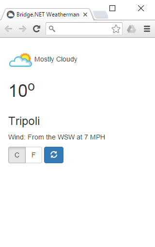
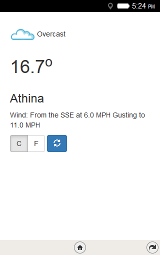
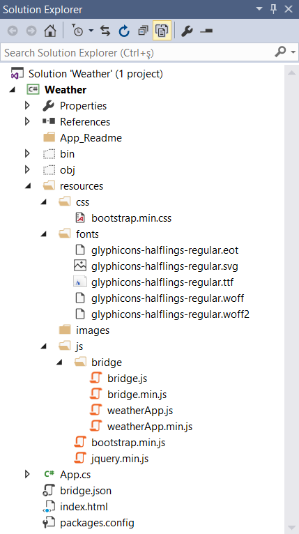
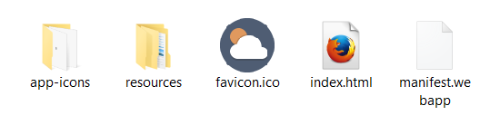

# Weather Mobile App

!!! Tuesday, 21 July 2015
The article has been updated to reflect the changes of migrating the Bridge Weather App from version 1.0 to the latest Bridge.NET version. Besides the packaged application for Firefox OS, an Android package is now available.
!!!

Fancy some mobile app goodness? PhoneGap may not be here just yet but let us see how you can build a Bridge.NET project that runs on the browser, Firefox OS and on Android.

[Firefox OS](https://www.mozilla.org/en-US/firefox/os/) is a Mozilla powered mobile Operating System entirely built on JavaScript. You code your apps in JavaScript having both the general Web API of the language and a special [device API](https://developer.mozilla.org/en-US/Apps/Reference/Firefox_OS_device_APIs) at your disposal.

## Bridge Weather App

The sample project is a weather application that reports the temperature and wind conditions for your current location. The HTML5 **Geolocation** API is used to locate your position and weather data are fetched by a AJAX call to the [Weather Underground API](http://api.wunderground.com/api/).

Here is how the application looks like in Chrome and in Firefox OS 2.0 Simulator.

Google Chrome | Firefox OS
--- | ---
 | 

!!!
The Bridge Weather App source code as well as the Firefox OS and Android packages can be found on [GitHub](https://github.com/bridgedotnet/Demos/tree/master/Mobile/Weather).
!!!

## New Bridge Project

To start with, you need to create a new Bridge.NET class library project in Visual Studio. Please, refer to the [Getting Started](../introduction/Getting_Started.md) article if you are not already familiar with how to set everything up. 

**Bridge.jQuery** and **Bridge.Bootstrap3** packages are required for this project. Enter the following command in the Package Manager Console to install them both.

```
PM > Install-Package Bridge.Bootstrap
```

Once ready, edit `App.cs` as shown below.

```csharp
public class App
{
    const string key = "c53b1d4229bccdc8";
    const string weatherUrl = 
       "http://api.wunderground.com/api/{0}/forecast/geolookup/conditions/q/{1},{2}.json";

    public static void Main()
    {
        GetForecast();

        // refresh button
        new jQuery(new ButtonElement
        {
            Type = ButtonType.Button,
            ClassName = "btn btn-primary",
            InnerHTML = "<span class=\"glyphicon glyphicon-refresh\"></span>",
            OnClick = App.UpdateButton_Click
        }).AppendTo("#btnDiv");
    }

    public static void GetForecast()
    {
        Global.Navigator.Geolocation.GetCurrentPosition(delegate(GeolocationPosition position)
        {
            GetWeather(position.Coords.Latitude, position.Coords.Longitude);
        });
    }

    public static void GetWeather(double lat, double lng)
    {         
        jQuery.GetJSON(
            string.Format(weatherUrl, key, lat, lng),
            null,
            delegate(object data, string s, jqXHR jqXHR)
            {
                // get all the information
                var selectedMetric = jQuery.Select("input[type='radio'][name='metric']:checked");
                var metric = (selectedMetric.Length > 0) ? selectedMetric.Val() : "c";
                var location = data["location"]["city"];
                var temp = data["current_observation"]["temp_" + metric];                    
                var img = data["current_observation"]["icon_url"];
                var desc = data["current_observation"]["weather"];
                var wind = data["current_observation"]["wind_string"];

                jQuery.Select("#location").Html(location.ToString());
                jQuery.Select("#temp").Html(temp.ToString());
                jQuery.Select("#desc").Html(desc.ToString());
                jQuery.Select("#wind").Html(wind.ToString());                                       

                jQuery.Select("#img").Attr("src", img.ToString());   
                    
                // select the user prefered metric                    
                jQuery.Select("#" + metric)
                    .Attr("checked", "checked")
                    .Parent().AddClass("active");
            }
        );
    }

    public static void UpdateButton_Click(Event e)
    {
        App.GetForecast();
    }
}
```

Highlighted code line 24 is most interesting. On the client side, web browsers work with `window.navigator.geolocation` while Firefox OS expects to find `navigator.geolocation`. The `Bridge.Global` alias solves this discrepancy. This is Bridge.NET magic!

## Bridge Configuration

Let's restructure the project to meet both the tasks of translating C# to Javascript and providing a host web application. Delete the **Bridge** folder and add the folders and sub folders illustrated in the screenshot below.



The `bridge.json` content should be as follows.

```js
{
    "output": "resources/js/bridge"
}
```

## Required JavaScript Files

The following table lists the JavaScript files used by the application. `bridge.js` and `weatherApp.js` are generated in the **resources\js\bridge** folder every time you build the project. 

Download `bootstrap.min.js` from the [Bootstrap site](https://getbootstrap.com/getting-started/#download) and `jquery.min.js` from the [jQuery site](https://jquery.com/) and copy them inside the `resources\js` folder.

File | Description
--- | ---
`bridge.js` | The main Bridge JavaScript file
`weatherApp.js` | Your generated JavaScript code
`jquery.min.js` | A minified version of the jQuery library
`bootstrap.min.js` | A minified version of the Bootstrap library

!!!
You may have noticed that most articles and code examples link to CDN Bootstrap and jQuery files. For the purposes of this article, local copies are required since using CDN links in Firefox OS apps is restricted.
!!!

## Bootstrap Miscellaneous Files

Bootstrap is used to provide a better UI experience. Besides `bootstrap.min.js` the files listed below are also required:

File | Description
--- | ---
`bootstrap.min.css` | The Bootstrap CSS. Place it inside the **resources\css** folder
`glyphicons-*.*` | Bootstrap fonts and glyphicons. Copy all files in the **resources\fonts** folder

You can optionally add a `favicon.ico` to the project. It is a nice thing to have.

## The Application Web Page

Note, that this does not have to be a ASP.NET WebForm or MVC page. A simple HTML page will do.

```html
<!DOCTYPE html>
<html>
<head>
    <meta name="viewport" content="width=device-width, initial-scale=1.0">
    <title>Bridge.NET Weatherman</title>
    <link href="resources/css/bootstrap.min.css" rel="stylesheet" />

    <script src="resources/js/jquery.min.js"></script>
    <script src="resources/js/bootstrap.min.js"></script>

    <script src="resources/js/bridge/bridge.js"></script>
    <script src="resources/js/bridge/weatherApp.js"></script>
     
</head>
<body style="padding: 20px;">
    <div id="forecast" class="container">
        <div class="row">
            <span class="col-*-2">
                
            </span>
            <span id="desc" class="col-*-4">
            </span>
        </div>
        <div class="row">
            <div class="col-*-12">
                <h1><span id="temp"> </span><sup>o</sup></h1>
            </div>
        </div>

        <div class="row">
            <div class="col-*-12">
                <h3><span id="location"> </span></h3>
            </div>
        </div>

        <div class="row">
            <div class="col-*-12">
                Wind: <span id="wind"></span>
            </div>
        </div>

        <div class="row" style="padding-top: 10px">
            <span class="col-*-9">
                <span class="btn-group" data-toggle="buttons">
                    <label class="btn btn-default">
                        <input type="radio" id="c" name="metric" value="c" /> C
                    </label>
                    <label class="btn btn-default">
                        <input type="radio" id="f" name="metric" value="f" /> F
                    </label>
                </span>
            </span>
            <span class="col-*-3" id="btnDiv">
            </span>
        </div>
</body>
</html>
```

## The Firefox OS Packaged Application

A Packaged Firefox OS application is basically a **folder** containing your JavaScript files plus the **manifest.webapp** configuration file.

Go ahead and create a new folder to act as your application container. The following image shows the files and sub-folders to include. Note that `index.html` and the **resources** folder are just copied over from the **Web Application** project.



The **app-icons** folder contains three images used by the Firefox OS. Normally, this is the same image as `favicon.ico` in 16x16, 48x48 and 128x128 dimensions.

## The Application Manifest

The application manifest provides information about an app (such as name, author, icon, and description) in a simple document usable by both users and app stores. Most importantly, it contains a list of Web APIs that your app needs. This allows users to make informed decisions about apps before installing them. It is one of the key things that distinguishes an App from a website.

```json
{
  "version": "0.1",
  "type": "privileged",
  "name": "Weatherman",
  "description": "A Bridge.NET weather application for Firefox OS",
  "launch_path": "/index.html",
  "icons": {
    "16": "/app-icons/icon-16.png",
    "48": "/app-icons/icon-48.png",
    "128": "/app-icons/icon-128.png"
  },
  "developer": {
    "name": "Bridge.NET"
  },
  "permissions": {
    "geolocation": {
      "description": "Needed for showing weather forecast for your current location"
    },
    "systemXHR": {
      "description": "Needed to fetch weather forecast data"
    }
  },
  "locales": {
    "ru": {
      "description": "Приложение Bridge.NET погода Firefox OS"
    },
    "el": {
      "description": "Μια Bridge.NET εφαρμογή πρόγνωσης καιρού για το Firefox OS"
    },
    "tr": {
      "description": "Firefox OS için bir Bridge.NET hava uygulaması"
    }
  },
  "default_locale": "en"
}
```

The Firefox OS application is now ready to use.

## Use The Firefox OS Simulator

Chances are you do not own a Firefox OS mobile device. Nevertheless, you can use the Firefox [WebIDE](https://developer.mozilla.org/en-US/docs/Tools/WebIDE/Opening_WebIDE) to test your application. WebIDE allows you to load various Firefox OS Simulators and load and run applications. Here are the steps to take:

* In Firefox, click <kbd>Shift</kbd>+<kbd>F8</kbd> to open the WebIDE. 
* From the menu, select **Project** >  **Open Packaged App...**, navigate to the root folder of your app and click the **Select Folder** button. The image below shows what the WebIDE should look like right now.


* Click **Select Runtime** and install at least one simulator by selecting the **Install Simulator** option. Fire up the simulator and click **Project** > **Install and Run**.

The weather application will be installed and run in the application. If everything goes well, you will be prompted to share your location. Click the **Share** button to have the weather data fetched and presented in the application's main page.

## The Android Package

Follow the steps below to package the Bridge Weather App for Android. 

* Install **[nodejs](https://nodejs.org/)**
* Install the **mozilla-apk-cli** node module command:

```
npm install -g mozilla-apk-cli
```

* Run **mozilla-apk-cli** inside the folder containing the packaged Firefox OS application:

```
mozilla-apk-cli . bridge_weather_app.apk
```

When done, copy the generated `.apk` to any Android device and tap it to install the app.

The Bridge Weather App source code as well as the Firefox OS and Android packages can be found on [GitHub](https://github.com/bridgedotnet/Demos/tree/master/Mobile/Weather).