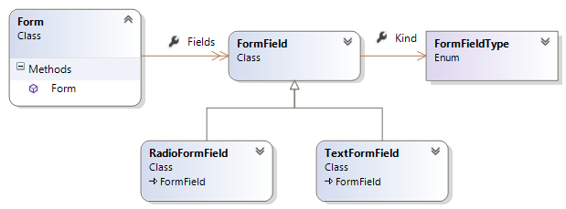
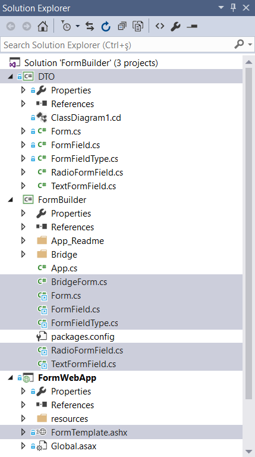
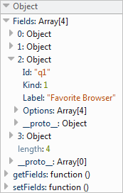

# Work With Data

More often than not projects consist of objects used to model the application domain or transfer data (Data Transfer Objects). When using Bridge.NET with a new or existing project (web or otherwise) you need to deal with these objects sooner or later. More specifically, two questions arise:

* Where the object classes should be defined since Bridge.NET overrides the .NET **System** namespace. This applies especially in multiple project solutions, e.g. a solution consisting of a Bridge.NET Class Library project and a Web Application project where the former references `Bridge.dll` while the latter uses **mscorlib**.
* How you can create object out of serialized data e.g. when making AJAX calls. 

## The Class Model 

To demonstrate we are going to use Bridge.NET to build an application that dynamically creates web forms based on template data. The data are fetched from a HTTP Handler, which is located in a Web Application project. 

What's important is that classes are used to model a web form as a collection of form fields (**Form** class). Each field has its own properties depending on its type. All fields share common properties inherited from the **FormField** class. To keep things simple, only two types of form fields are defined in the **FormFieldType** enumeration, **Text** and **Radio**.

```csharp
public partial class Form
{
    public List<FormField> Fields { get; set; }

    public Form()
    {
        this.Fields = new List<FormField>();
    }
}
```

```csharp
public class FormField
{
    public FormFieldType Kind { get; set; }
    public string Id { get; set; }
    public string Label { get; set; }
}
```

```csharp
public enum FormFieldType
{
    Text,
    Radio
}
```

```csharp
public class TextFormField : FormField
{
    public bool Required { get; set; }

    public TextFormField()
    {
        this.Kind = FormFieldType.Text;
        this.Required = false;
    }
}
```

The class diagram below will help you understand the class model.



## The Solution Structure



It is also important to note that all these classes are used by both the Bridge.NET Class Library project and the Web Application project. Since they cannot be defined in either project (as explained earlier) we are going to place them in a separate project of their own. We can then add a reference to it from the Web Application project. We can also add them as links to the Bridge.NET project. 

The image shown how the Visual Studio solution is structured (the **DTO** Class Library project is the one containing the shared classes).

The steps to add existing items in a project as links are described in the [How to: Add Existing Items to a Project](https://msdn.microsoft.com/en-us/library/9f4t9t92%28v=vs.90%29.aspx" target="_blank) MSDN article.

## Data Transfer Objects

The following code shows the template data returned by the HTTP Handler serialized in JSON format. 

!!!
The Json.NET library is used to perform JSON serialization. This is not directly related to Bridge.NET but rather a matter of personal preference.
!!!

```csharp
public class FormTemplate : IHttpHandler
{

    public void ProcessRequest(HttpContext context)
    {
        context.Response.ContentType = "application/json";
        context.Response.Write(JsonConvert.SerializeObject(this.Template));
    }

    private Form Template
    {
        get
        {
            return new Form()
            {
                Fields = {
                    new TextFormField()
                    {
                        Id = "name", Label = "Full Name"
                    },

                    new TextFormField()
                    {
                        Id = "email", Label="Email", Required = true
                    },

                    new RadioFormField()
                    {
                        Id="q1", 
                        Label = "Favorite Browser", 
                        Options = "IE,Firefox,Chrome,Safari".Split(',')
                    },

                    new RadioFormField()
                    {
                        Id="q2", 
                        Label = "Favorite Language", 
                        Options = "C#,JavaScript,Both".Split(',')
                    }
                }
            };
        }
    }
}
```

On the Bridge.NET side, a **jQuery.Ajax** call is made to the HTTP Handler to get the template data. The following code shows how you can build the class model of the web form out of the received data.

!!!
Please note that the method presented here applies at the time of this writing and is expected to be greatly simplified in future releases of Bridge.NET. There is also a related, open [GitHub issue](https://github.com/bridgedotnet/Bridge/issues/98" target="_blank) to track the development of `JSON.Parse`.
!!!

```csharp
public static void Main()
{
    // fetch form template from http handler and start building form
    jQuery.Ajax(
        new AjaxOptions()
        {
            Url = "FormTemplate.ashx",
            Cache = false,
            Success = delegate(object data, string str, jqXHR jqXHR)
            {
                Form template = new Form(data);
                App.CreateForm(jQuery.Select(FORM_CONTAINER), template);
            }
        }
    );
}
```

Here is the JSON formatted data returned from the server to the **success** callback.

```js
{
  "Fields":[{
      "Required":false,
      "Kind":0,
      "Id":"name",
      "Label":"Full Name"
    }, {
      "Required":true,
      "Kind":0,
      "Id":"email",
      "Label":"Email"
    }, {
      "Kind":1,
      "Id":"q1",
      "Label":"Favorite Browser",
      "Options":["IE","Firefox","Chrome","Safari"]
    }, {
      "Kind":1,
      "Id":"q2",
      "Label":"Favorite Language",
      "Options":["C#","JavaScript","Both"]
    }
  ]
}
```

## Points Of Interest

Use **dynamic** to represent an object whose operations will be resolved at runtime. In this case, the **foreach** iteration is made possible on the **rawFields** object. Please note, **Form** is a partial class (Bridge.NET supports partial classes) and the use of **dynamic** is encapsulated in its constructor defined in the `BridgeForm.cs` file. Also note how nicely Bridge.NET supports enumerations and casting in particular. 

```csharp
using Bridge;

namespace DTO
{
    public partial class Form
    {
        public Form(object obj) 
            : this()
        {
            dynamic rawFields = obj["Fields"];

            foreach (var rawField in rawFields)
            {
                if (rawField["Kind"] == (int)FormFieldType.Radio)
                {
                    this.Fields.Add(new RadioFormField()
                    {
                        Id = rawField["Id"],
                        Label = rawField["Label"],
                        Options = rawField["Options"]
                    });
                }
                else
                {
                    this.Fields.Add(new TextFormField()
                    {
                        Id = rawField["Id"],
                        Label = rawField["Label"],
                        Required = rawField["Required"]
                    });
                }
            }
        } 
    }
}
```

## Other Options

Another option is to make use of the `JSON.Parse` method. The following code:

```csharp
var template = JSON.Parse<Form>(jqXHR["responseText"].ToString());
```

emits:

```js
var template = Bridge.merge(new DTO.Form(), JSON.parse(jqXHR.responseText.toString()));
```

The image below shows what is created in the client side if you log the object to the console.



Have in mind that **JSON.Parse** has certain limitations as it is going to work only for classes with properties of primitives types and no methods.

## Test It Yourself

The **FormBuilder** Visual Studio solution is [available on GitHub](https://github.com/bridgedotnet/Demos/tree/master/Combination_Samples/FormBuilder) as part of public **Demos** repository. You can also [download](/wp-content/uploads/FormBuilder.zip) it as a zip file.

Please, feel free to clone and test things for yourself.