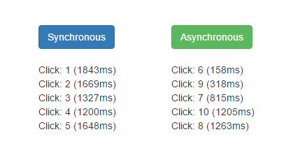

# Asynchronous Programming

You can avoid performance bottlenecks and enhance the overall responsiveness of your application by using asynchronous programming. The [async](https://msdn.microsoft.com/en-us/library/hh156513.aspx) and [await](https://msdn.microsoft.com/en-us/library/hh156528.aspx) keywords in C# are intended to help create an asynchronous method (also referred to as **async methods**) almost as easily as you create a synchronous method. Bridge.NET fully supports `async` and `await` and this article demonstrates how to use them to have **async methods** emitted in your JavaScript code.

## Getting Started

Start by creating a new Bridge.NET Class Library project in Visual Studio. If you are not already familiar with this process, please follow the steps described in the [Getting Started With Bridge.NET](../introduction/Getting_Started.md) article.

Besides the **Bridge** and **Bridge.Html5** namespaces you also need to install **Bridge.jQuery2** which is used by the examples below. Use the NuGet Console and run the following command:

```
Install-Package Bridge.jQuery
```

The `Bridge\www\demo.html` page should also be updated to reference **jQuery**. For example:

```html
<!DOCTYPE html>

<html lang="en" xmlns="http://www.w3.org/1999/xhtml">
<head>
    <meta charset="utf-8" />
    <title>Bridge Async/Await</title>

    <script src="https://code.jquery.com/jquery-2.1.4.min.js"></script>

    <script src="../output/bridge.js"></script>
    <script src="../output/demo.js"></script>
</head>
<body>
	<!-- 
		Right-Click on this file 
		and select "View in Browser"
	--> 
</body>
</html>
```

Once the project is set up, you can edit the `App.cs` file to type in the following examples and run them using the same web page shown above.

## Example 1

The first example shows how you can use async methods to improve UI responsiveness. Comparing the synchronous and asynchronous versions of the same code is the best way to see the difference, so there are two classes defined in the code, one for each version. In both cases, the `LogData` and `LongRunningProcess` methods do the same work except for the `async` and `await` modifiers are used in the asynchronous version. Also, the [Task.Delay](https://msdn.microsoft.com/en-us/library/hh194845%28v=vs.110%29.aspx) async method is called to actually initiate concurrency, in the `Asynchronous.LongRunningProcess` method.

You can click the two buttons repeatedly to see how the web page remains responsive when the async methods are used.



!!!
This sample has also been added to [Deck.NET](https://deck.net/async).
!!!

The following code comparison demonstrates the very little changes required by the developer to write the asynchronous version of the example.

```csharp
public static void LogData(Action<string> log)
{
    App.count++;

    var data = 
        Synchronous.LongRunningProcess(
             App.count
        );

    log("#col1", data);
}

public static string LongRunningProcess(int id)
{
    // Force a Delay
    // Simulate a long running process

    var delay = Math.Random() * 2000;

    var end = DateTime.Now.AddMilliseconds(
        (int)delay).GetTime();

    while (DateTime.Now.GetTime() < end)
    {

    }

    return "Click: " + id + " (" + Math.Floor(delay) + "ms)";
}
```


```csharp
public static async void LogData(Action<string> log)
{
    App.count++;

    var data = await 
        Asynchronous.LongRunningProcess(
            App.count
        );

    log("#col2", data);
}

public static async Task<string> LongRunningProcess(int id)
{
    // Force a Delay
    // Simulate a long running process

    var delay = Math.Random() * 2000;

    await Task.Delay((int)delay);

    return "Click: " + id + " (" + Math.Floor(delay) + "ms)";
}
```

### Return Types For Async Methods

There are two return types for async methods: `Task` and `Task<T>`. When converting from synchronous to asynchronous code, any method returning a type T becomes an async method returning `Task<T>`, and any method returning void becomes an async method returning Task. They are all supported by Bridge.NET.

Below, you can find the complete source code for the sample.

```csharp
using Bridge;
using Bridge.Html5;
using Bridge.jQuery2;
using System;
using System.Threading.Tasks;

namespace Demo
{
    public class App
    {
        public static int count = 0;

        public static void Main()
        {
            var body = Document.Body;

            var title = new HeadingElement(HeadingType.H2);
            title.InnerHTML = "Synchronous vs Asynchronous";

            body.AppendChild(title);

            body.AppendChild(new ParagraphElement
            {
                InnerHTML = "Each click of a Button will create a " + 
                    "random delay, then log a message to the screen."
            });
            
            body.AppendChild(new ParagraphElement
            {
                InnerHTML = "Step 1: Rapidly click the Synchronous " +
                    "Button, then wait a few moments for all log " +
                    "messages to appear.<br />Step 2: Rapidly click " +
                    "Asynchronous Button."
            });
            
            body.AppendChild(new ParagraphElement
            {
                InnerHTML = "Notice difference in sequence of log " +
                    "index values as thread locking issues have " +
                    "been removed with use Async/Await."
            });

            var row = new DivElement
            {
                ClassName = "row"
            };

            var col1 = new DivElement
            {
                Id = "col1",
                ClassName = "col-md-2"
            };

            var btn1 = new ButtonElement
            {
                InnerHTML = "Synchronous",
                ClassName = "btn btn-primary",
                OnClick = (ev) =>
                {
                    Synchronous.LogData(App.Log);
                }
            };

            col1.AppendChild(btn1);

            var col2 = new DivElement
            {
                Id = "col2",
                ClassName = "col-md-2"
            };

            var btn2 = new ButtonElement
            {
                InnerHTML = "Asynchronous",
                ClassName = "btn btn-success",
                OnClick = (ev) =>
                {
                    Asynchronous.LogData(App.Log);
                }
            };

            col2.AppendChild(btn2);

            row.AppendChild(col1);
            row.AppendChild(col2);

            body.AppendChild(row);
        }

        private static void Log(string selector, string msg)
        {
            var div = new DivElement { InnerHTML = msg };
            jQuery.Select(selector).Append(div);
        }
    }

    public class Synchronous
    {
        public static void LogData(Action<string, string> log)
        {
            App.count++;

            var data = Synchronous.LongRunningProcess(App.count);

            log("#col1", data);
        }

        public static string LongRunningProcess(int id)
        {
            // Force a Delay
            // Simulate a long running process

            var delay = Math.Random() * 2000;

            var end = DateTime.Now.AddMilliseconds((int)delay).GetTime();

            while (DateTime.Now.GetTime() < end)
            {

            }

            return "Click: " + id + " (" + Math.Floor(delay) + "ms)";
        }
    }

    public class Asynchronous
    {
        public static async void LogData(Action<string, string> log)
        {
            App.count++;

            var data = await Asynchronous.LongRunningProcess(App.count);

            log("#col2", data);
        }

        public static async Task<string> LongRunningProcess(int id)
        {
            // Force a Delay
            // Simulate a long running process

            var delay = Math.Random() * 2000;

            await Task.Delay((int)delay);

            return "Click: " + id + " (" + Math.Floor(delay) + "ms)";
        }
    }
}
```

## Example 2

The second example adds two `div` elements to the web page that start fading in and out when a button is clicked.  The `async` keyword is used with an anonymous delegate to define the button's click event handler.

```csharp
button.OnClick += async delegate { };
```

Animation for each `div` is supplied as a task to the [Task.WhenAll](https://msdn.microsoft.com/en-us/library/system.threading.tasks.task.whenall%28v=vs.110%29.aspx) method. This method asynchronously awaits multiple asynchronous operations, which are represented as a collection of tasks and returns a single task that isn’t complete until every task in the collection is completed. The tasks appear to run in parallel, but no additional threads are created. The tasks can complete in any order.

```csharp
button.OnClick += async delegate
{
    var task1 = RunAnimation(div1);
    var task2 = RunAnimation(div2);
    await Task.WhenAll(task1, task2);

    Window.Alert("Complete");
};
```

`Task.WhenAll` can be used instead of multiple `await` to improve performance, make the code easier to read and propagate all errors at once.

Below, you can find the complete source code of the example:

```csharp
using Bridge;
using Bridge.Html5;
using Bridge.jQuery2;
using System;
using System.Threading.Tasks;

namespace Demo
{
    public class App
    {
        public static void Main()
        {
            var div1 = CreateDiv();
            var div2 = CreateDiv();

            var button = new ButtonElement
            {
                InnerHTML = "Animate"
            };

            button.OnClick += async delegate
            {
                var task1 = RunAnimation(div1);
                var task2 = RunAnimation(div2);
                await Task.WhenAll(task1, task2);

                Window.Alert("Complete");
            };

            Document.Body.AppendChild(button);
        }

        public static async Task FadeOut(DivElement div)
        {
            double opacity = 1;

            while (opacity > 0)
            {
                div.Style.Opacity = opacity.ToString();
                opacity -= 0.01;
                await Task.Delay(13);
            }

            div.Style.Visibility = Visibility.Hidden;
        }

        public static async Task FadeIn(DivElement div)
        {
            double opacity = 0;
            div.Style.Visibility = Visibility.Visible;

            while (opacity < 1)
            {
                div.Style.Opacity = opacity.ToString();
                opacity += 0.01;
                await Task.Delay(13);
            }
        }

        private static DivElement CreateDiv()
        {
            var div = new DivElement
            {
                Style =
                {
                    Width = "100px",
                    Height = "100px",
                    Margin = "10px",
                    BackgroundColor = HTMLColor.Black
                }
            };

            Document.Body.Style.Padding = "30px;";
            Document.Body.AppendChild(div);
            return div;
        }

        public static async Task RunAnimation(DivElement div)
        {
            await FadeOut(div);
            await Task.Delay(1000);
            await FadeIn(div);
        }
    }
}
```