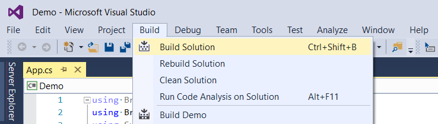

# Getting Started

Getting started with [Bridge.NET](https://bridge.net/) is very quick and easy. We've tried our best to simplify the process and make it as trouble free as possible.

Let's walk through the steps required to get a basic project started. The first thing we need to do is install Bridge.NET into Visual Studio. Adding the Project Templates takes only a few seconds.

## Add To Visual Studio

#### Two Easy Steps

1. Download the [Bridge.NET.vsix](https://marketplace.visualstudio.com/items?itemName=BridgeNET.BridgeNET) file and run it (or double-click). It's a tiny 27kb file and includes almost no options. See more [download](https://bridge.net/download/) options.
1. Click the **Install** button. **You're done!**


## Removing

What if I don't want Bridge on my system later? No worries. Removal is quick and leaves no trace. Just go up to the main Visual Studio menu and click <kbd>Tools</kbd> > <kbd>Extensions and Updates...</kbd>. Next select **Bridge.NET** from the list, and click **Uninstall**. Poof. gone.


## New Project

We now have all the pieces in place and we're ready to jump into creating a new **Class Library** project. Once again, the steps are very basic:

1. Open Visual Studio. Any of the recent versions of Visual Studio will do, including 2013, 2015 and 2017.
1. From the main menu click on <kbd>File</kbd> > <kbd>New Project</kbd>.
1. From the list of installed templates, choose **Bridge.NET**, then **Class Library**.
1. Give the Project a name, here we'll use **Demo**, then click the **Ok** button.


Your **Demo** project should only take a moment to set up.


### Add Bridge.Html5

!!!
As of Bridge 17.0, [Bridge.Html5](https://www.nuget.org/packages/bridge.html5) is no longer automatically included in the default Bridge installation package and must be installed separately. It only takes a few seconds to install Bridge.Html5 by running the `install-package Bridge.Html5` command from within the NuGet Package Manager Console.
!!!

Once finished open up the default `.cs` file that is created and lets quickly review line-by-line.

```csharp
using System;
using Bridge;
using Bridge.Html5;

namespace Demo
{
    public class Program
    {
        public static void Main()
        {
            // Create a new Button
            var button = new HTMLButtonElement();
            
            button.InnerHTML = "Click Me";
            button.OnClick = (ev) =>
            {
                // When Button is clicked, 
                // the Bridge Console should open.
                Console.WriteLine("Success!");
            };

            // Add the Button to the page
            Document.Body.AppendChild(button);
        }
    }
}
```

Run the sample above on [Deck.NET](https://deck.net/82ae7cc7048fe47422e7bd1a944475b2).

First off we have the `using` statements, and as with all C# applications, the using statements import functionality. 

For this basic sample creating an HTML Button, we include the `Bridge` and `Bridge.Html5` assemblies.

Next up is declaring the **Demo** namespace. This is the name you supplied a few moments ago when the project was first created. Inside the namespace, the `App` class is defined, and then a simple static Method called `Main()`. If you've ever created a Console Application in C#, this `App.cs` file should look _very_ familiar.

If you declare a `static void Main()` Method, this Method will be auto-run on initial page load. Think of this as the entry point into your application. 

The body of the `Main` Method steps through creating a simple `HTMLButtonElement`, adding an `OnClick` handler, then adding the button to the page. Clicking this button will open the **Bridge Console** and display our `Success!` message. 

At this point we're ready to Build the Solution by going to **Build** > **Build Solution** in the menu, or use either the <kbd>F6</kbd> key or keyboard combo <kbd>Ctrl</kbd> + <kbd>Shift</kbd> + <kbd>B</kbd>.



## Show Me The JavaScript!

Your project should compile quickly, and your newly created JavaScript files have been added to the projects `Bridge/output` folder, although Visual Studio might be hiding the new JavaScript files... 

Visual Studio requires one extra click to reveal. Clicking the **Show All Files** button on the Solution Explorer toolbar will unveil your newly compiled JavaScript files.


Within the **Bridge/output** folder you should find new JavaScript files:

| Name | Description |
| --- | --- |
| `bridge.js` | The main Bridge JavaScript file required on all pages. |
| `demo.js` | Your generated JavaScript code. |

Lets first review `demo.js` by double-clicking to open. You should see the following:

```js
Bridge.assembly("Demo", function ($asm, globals) {
    "use strict";

    Bridge.define("Demo.Program", {
        main: function Main () {
            var button = document.createElement("button");

            button.innerHTML = "Click Me";
            button.onclick = function (ev) {
                System.Console.WriteLine("Success!");
            };

            document.body.appendChild(button);
        }
    });
});
```

This is the Bridge generated JavaScript compilation of your C# code. We can see the call to the auto-run `Main()` Method from C# which is automatically run on the initial page load.

View this working code sample online using [Deck.NET](https://deck.net/82ae7cc7048fe47422e7bd1a944475b2).

Another interesting feature to point out, notice how inline comments from C# are maintained in the generated JavaScript code. This reinforces the concept that the product of your C# code library is another code library. One language is transformed into another.

These inline comments and all other unnecessary whitespace are removed from the auto-generated `.min.js` version of each file. You can think of the `.min.js` files as your Release files and the regular `.js` files as your Debug versions. During testing and development, use `demo.js`. When your application is ready for user testing, or release, link to `demo.min.js`.

## bridge.js

The `bridge.js` file is auto-generated and required to be included on the page before your custom JavaScript files, such as `demo.js`. Feel free to explore around `bridge.js` as it includes all the handy JavaScript library functionality of Bridge.NET.

## View In Browser

So far all we've seen is the generated JavaScript code, but let's get this sample working in a web browser by adding the `.js` files to a simple `.html` page.

By default, the installation of Bridge also creates a simple .html file pre-configured with the required JavaScript file includes. The .html file should be located in your projects `/bin/debug/bridge/` folder. 


This simple .html file is all you require to run your new Bridge application. Right-click on the file and select <kbd>View in Browser</kbd>.

```html
<!DOCTYPE html>

<html lang="en" xmlns="http://www.w3.org/1999/xhtml">
<head>
    <meta charset="utf-8" />
    <title>Bridge Demo</title>
    <script src="../output/bridge.min.js"></script>
    <script src="../output/demo.js"></script>
</head>
<body>
    <!-- 
        Right-Click on this file and select "View in Browser"
    --> 
</body>
</html>
```


Your default web browser should open up automatically and load `demo.html`. Immediately upon loading the page, the **Bridge Console** should open and log the `Success!` message.


## Summary

We've broken apart the getting started into simple steps and hopefully provided some helpful tips and tricks along the way. In real time, completing these steps from start to finish should only require a couple minutes