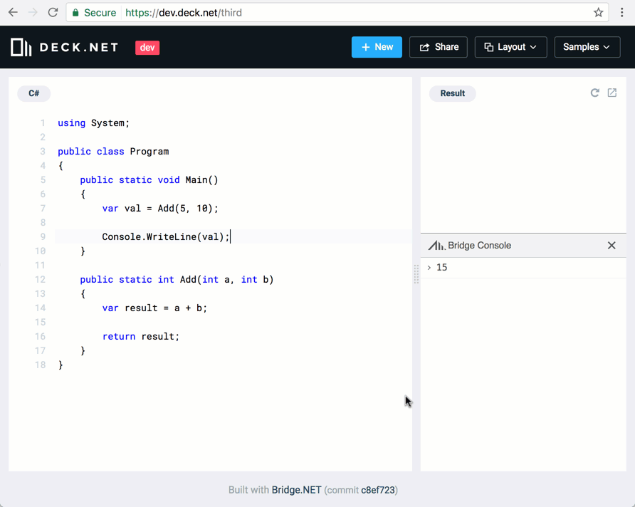

# Global Configuration

The `bridge.json` file is a global configuration file for a Bridge project and by default is added to the root of your Project.

A very basic `bridge.json` configuration file would look as follows:

```json
{
  "output": "$(OutDir)/bridge/"
}
```

The `bridge.json` file is mapped to the **AssemblyInfo** class. All settings of the **AssemblyInfo** class are available to configure within `bridge.json`.

Including a `bridge.json` file in your project is not a requirement for the Bridge compiler. If a `bridge.json` is missing, the compiler will just assume the default values.

## Custom bridge.json files

If your project has the default **Release** and **Debug** build modes, you can define separate `bridge.json` files for each build mode, as well as a default `bridge.json` file for common configs of all build modes.

| File Name | Description |
| --- | --- |
| `bridge.json` | Common configurations applied to all build modes. |
| `bridge.Debug.json` | Configuration only applied during Debug mode compilation. Takes precedence over the same settings if configured in bridge.json. |
| `bridge.Release.json` | Configuration only applied during Release mode compilation. Takes precedence over the same settings if configured in bridge.json. |

The config file name is case-sensitive. For example, if the build mode name is **Release**, the file name must be `bridge.Release.json`, and not bridge.release.json.

Custom bridge.json files are not limited to **Debug** and **Release** build modes. If you have a custom build mode, for example, **Staging**, just add a `bridge.Staging.json` file.

## `afterBuild`

**Type:** `string`

The executable file to be launched after building. You can use absolute or relative paths. A relative path starts with the project's root. An example of usage could be configuring afterBuild to trigger a `.bat` file to copy the generated JavaScript files to another folder location, such as another web project.

```json
{
  "afterBuild": "Bridge/build/deploy.bat"
}
```

Sample [deploy.bat](https://gist.github.com/geoffreymcgill/d4963a38647c442c7a43) file.

## `beforeBuild`

**Type:** `string`

The executable file to be launched before building. You can use absolute or relative paths. A relative path starts with the project's root. An example of usage could be configuring beforeBuild to trigger a `.bat` file to remove all files from a directory before compiling.

```json
{
  "beforeBuild": "Bridge/build/clean.bat"
}
```

Sample [clean.bat](https://gist.github.com/geoffreymcgill/5ed82fcbfc5414e19c93) file.

## `cleanOutputFolderBeforeBuild`

**Type:** `boolean`
    
Cleans up Bridge's output folder before starting to dump built JavaScript files. Defaults to `false`.

```json
{
  "cleanOutputFolderBeforeBuild": false
}
```

!!!danger Use with great care.
This will _recursively_ erase all files and directories in the output directory!

We do not recommend using this feature.
!!!

## `cleanOutputFolderBeforeBuildPattern`

By default, the `cleanOutputFolderBeforeBuild` config will use the search pattern `*.js|*.d.ts` to remove files. 

The following sample demonstrates how to override the default pattern.

```json
{
  "cleanOutputFolderBeforeBuildPattern": "*myApp*.js|bridge.js|*myApp*.d.ts"
}
```

!!!danger SERIOUSLY!! 
Use with great care. This will _recursively_ erase all files and directories in the output directory!

DO NOT USE
!!!

## `buildArguments`

**Type:** `string`
    
Passes extra arguments to the builder (msbuild or xbuild) process.

```json
{
  "buildArguments": "/nologo"
}
```

## `combineLocales`

**Type:** `boolean`
    
Merges all locale files into a single file instead of individual locale name files (`en-US.js` for instance). Defaults to `false`.

```json
{
  "combineLocales": true
}
```

!!!
If [combineScripts](#combinescripts) is used in conjunction with this (`combineScripts: true`), all the code will be emitted in a single file: locales, Bridge base and Bridge user code. Additionally on this case, the [localesFileName](#localesfilename) setting will be ignored from `bridge.json`.
!!!

## `combineScripts`

**Type:** `boolean`
    
Combines `bridge.js` and user code in a same file instead of following rules determined by [fileNameCasing](#fileNameCasing) and [outputBy](#outputby) to determine file names. The output file name then will be the project name.

```json
{
  "combineScripts": true
}
```

!!!
This option implies both [fileNameCasing](#fileNameCasing) and [outputBy](#outputby) options will be ignored from `bridge.json` file.
!!!

## `configuration`

**Type:** `string`

Override project's 'Configuration' used for paths. By default, this value is queried from the project.

```json
{
  "configuration": "Release"
}
```

The above example will force to get DLLs from `bin/Release/` regardless of current project's selected configuration (`Debug` for example).

## `console`

Enables global configuration of **Bridge Console** functionality.

By default, the `bridge.console.js` file is generated and included in the project output. To disable the **Bridge Console**, the `bridge.console.js` file can be removed from your .html file, or by setting `"enabled": false`.

| Name | Type | Description |
| --- | --- | --- |
| `enabled` | bool | Set to `true` to include **Bridge Console**. Default is `false`. |

```json
{
  "console": {
    "enabled": true
  }
}
```

## `defineConstants`

**Type:** `List<string>`
    
Override project's `<DefineConstants>` setting/tag in .csproj file. By default, the list is loaded off the .csproj.

```json
{
  "defineConstants": [ "MyConstant1", "MyConstant2" ]
}
```

## `dependencies`

**Type:** `List<IPluginDependency>`

Determines a list of required plugins loaded before building the Bridge.NET project. By default, no plugin is required (empty list).

```json
{
  "dependencies": [
    { "dependencyName": "MyPlugin1", variableName: "MyVar1" },
    { "dependencyName": "MyPlugin2", variableName: "MyVar2" }
  ]
}
```

## `namedFunctions`

**Type:** `NamedFunctionMode`

Creates named function expressions in the emitted JavaScript functions. The default value is `None`.

```json
{
  "namedFunctions": "FullName"
}
```

```csharp Example
public class Program
{
    public void DoSomething()
    {
    }
}
```

```js Output
// If None (default)
DoSomething: function () { }

// If Name
DoSomething: function DoSomething() { }

// If FullName
DoSomething: function Program_DoSomething() { }
```

### Options

**NamedFunctionMode** includes the following options:

| Name | Description |
| --- | --- |
| `None` | No named function expressions. |
| `Name` | Named function expressions is composed of Method name. |
| `FullName` | Named function expressions is composed of Class name and Method name. |

The setting is available in `bridge.json` and would apply the extra function name to all Methods in the whole assembly. It's an assembly level on or off setting, with an explicit decision to enable. Please see Issue [#2407](https://github.com/bridgedotnet/Bridge/issues/2407) for more information.

## `fileName`

**Type:** `string`

The file name where the JavaScript files are copied to. If omitted, it is `[namespace].js` by default. 

```json
{
  "fileName": "demo.js"
}
```

You can decorate any class with a `[FileName('myClass.js')]` attribute. The class script will be generated to the defined file. It supersedes a global fileName setting.

## `fileNameCasing`

**Type:** `string`

Sets the filename casing convention used while generating the `.js` files. Default is `CamelCase`.

```json
{
  "fileNameCasing": "Lowercase"
}
```

### Options

#### CamelCase

Groups and converts all filenames by lowerCamelCase.

```
namespace Demo => demo.js
namespace Demo.Utilities => demo.utilities.js
namespace DemoUtilities => demoUtilities.js
```

This is the default functionality of Bridge.

#### Lowercase

Groups and converts all filenames to lowercase.

```
namespace Demo => demo.js
namespace Demo.Utilities => demo.utilities.js
namespace DemoUtilities => demoutilities.js
```

#### None

No case conversion is applied.

```
namespace Demo => Demo.js
namespace Demo.Utilities => Demo.Utilities.js
namespace DemoUtilities => DemoUtilities.js
```

## `generateDocumentation`

**Type:** `DocumentationMode`
    
Options to manage the output of JSDoc-compatible documentation in the generated JavaScript and TypeScript definition files. Default is `Basic`.

```json
{
  "generateDocumentation": "Full"
}
```

### Options

| Name | Type | Description |
| --- | --- | --- |
| None | string | Suppresses all JSDoc comments. |
| Basic | string | Translates any existing XML Doc comments into JSDoc comments. |
| Full | string | Annotates all generated JavaScript and TypeScript definitions with JSDoc comments. |

## `generateTypeScript`

**Type:** `boolean`
    
Toggles TypeScript support. If set to `true` TypeScript definitions (**.d.ts**) are generated along with the matching JavaScript files. `false`, by default.

```json
{
  "generateTypeScript": true
}
```

## `html`

Automatically generate a `index.html` file and add the file to the `output` directory. 

The html file will be configured by the Bridge compiler to include the JavaScript files for the project.

The `index.html` can be opened in a browser to run the project.

### Options

| Name | Type | Description |
| --- | --- | --- |
| `disabled` | bool | `true` to disable automatic generation of the html file. Default is `false`. |
| `title` | string | A custom string to use as the html files `<title>` value. |

```json
{
  "html": {
    "disabled": false,
    "title": "My Bridge Demo App"
  }
}
```

## `loader`

Bridge supports **AMD**, `CommonJS`, **UMD** and **ES6** Modules (**AMD** is default).

The `[Module]` attribute can be applied to a class or assembly (in this case all classes belonging to the assembly will be included in the module).

The `[Module]` attribute can accept module type and/or module name. Required module code depends on module type (for example, `define` method is generated for **AMD**).

By default, if an application uses a module, Bridge will generate code to load that module (for example, using `require` method). All modules will be loaded during application startup.

If you want to load modules manually (for example, bundle into one file and manually include in your .html) then module loading can be disabled using the `loader` config.

See Issue [#2217](https://github.com/bridgedotnet/Bridge/issues/2217) for additional details.

| Name | Type | Description |
| --- | --- | --- |
| `type` | `AMD`, `CommonJS`, `ES6` | The Module loading system. Default is `"AMD"`. |
| `loaderFunction` | `string` | A custom loader function. Default is `"require"`. |
| `manualLoading` | `bool` | `true` to disable automatic modules loading. Default is `false`. |
| `manualLoadingMask` | `string` | A mask to define which modules should be excluded from auto-loading. Default is `""`. |
| `skipManualVariables` | `bool` | `true` to disable variable generation if the module is disabled then a variable is created which will be initialized after loading that module manually if call `Module.Load` Default is `false`. |

```json
{
  "loader": {
    "type": "CommonJS",
      "manualLoading": true
  }
}
```

## `locales`

**Type:** `string`
    
A semicolon-delimited list of locales to emit during Bridge build. Defaults to empty (no locale file emission). Can contain the keyword `all` or wildcard `*` (asterisk) to select locales.

```json
{
  // Include all cultures
  "locales": "all",

  // Include three specific cultures
  "locales": "en-US;pt-BR;ru-RU",

  // Wildcards 
  "locales": "en-*;pt-*",
}
```

## `localesFileName`

**Type:** `string`
    
When [combineLocales](#combinelocales) is used (`combineLocales: true`), specifies the filename to which emit localisation scripts. Defaults to `Bridge.Locales.js`.

```json
{
  "combineLocales": true
  "localesFileName": "locales.js"
}
```

## `localesOutput`

**Type:** `string`
    
Output folder to locale files' output. Either an absolute path or relative to Bridge's [output](#output) path.

```json
{
  // A project root folder name
  "localesOutput": "locales",

  // Relative path from the project root
  "localesOutput": "/home/customers/site/js/locales",

  // Full local path anywhere
  "localesOutput": "c:/inetpub/site/js/locales",
}
```

## `logging`

Add compilation logging to your Project by setting the `logging` config in the Projects `bridge.json` file. 

The logger will output a tab-delimited `bridge.log` file with the following fields in each row:

- timestamp (if enabled in config)
- level
- source
- message

| Name | Values | Description |
| --- | --- | --- |
| `level` | `None`, `Error`, `Warning`, `Info`, and `Trace` | The level of logging to perform. Default is `"None"`. |
| `timestamps` | `true` or `false` | Include a timestamp for each log item. Default is `true`. |
| `maxSize` | `16777216` | Maximum log file size in bytes. Default is `16777216`. |
| `path` | `""` | Relative to the bridge output folder, defaults to the [output](#output) location. |
| `fileName` | `"bridge.log"` | The name of the log file. Default is `"bridge.log"`. |

The following sample demonstrates adding `"Trace"` level logging. 

```json
{
  "logging": {
    "level": "Trace"
  }
}
```

``` bridge.log
2017-06-30T20:02:07:847     Trace       Reading define constants...
2017-06-30T20:02:07:854     Trace       Reading define constants done
2017-06-30T20:02:07:860     Trace       Reading project file done
2017-06-30T20:02:07:866     Trace       Inspecting references...
2017-06-30T20:03:47:187     Trace    Bridge    Inspecting references done
2017-06-30T20:03:47:195     Trace    Bridge    Discovering plugins...
2017-06-30T20:03:47:202     Trace    Bridge    Current domain bridge.exe
```

## `module`

**Type:** `string`

The global Module setting. If set up, the entire project is considered as one Module. Though, you are still able to define a Module attribute on the class level.

```json
{
  "module": "MyModule"
}
```

## `output`

**Type:** `string`

The output folder path for generated JavaScript. A non-absolute path is concatenated with the project's root. Absolute paths are also permitted.

```json
{
  // Send to the projects /bin/ folder
  "output": "$(OutDir)/bridge/" 

  // A relative path from Project root
  "output": "../Bridge/output" 

  // An absolute path
  "output": "c:/output" 
}
```

The following MSBuild properties are supported within `output`.

| Name |
| --- |
| `$AssemblyName` |
| `$CheckForOverflowUnderflow` |
| `$Configuration` |
| `$DefineConstants` |
| `$OutDir` |
| `$OutputPath` |
| `$OutputType` |
| `$Platform` |
| `$RootNamespace` |

## `outputBy`

**Type:** `OutputBy`

Options to manage JavaScript output folders and files. Defaults to `Project` (`Namespace` before **v16.0**).

```json
{
  "outputBy": "NamespacePath"
}
```

### Options

**OutputBy** includes the following options:

| Name | Description |
| --- | --- |
| `Class` | The class name will be the file name. If there are classes with same names in different namespaces, the generated JavaScript will be combined into one file. For example, if the class name is **Helpers**, the file name will be `Helpers.js`. |
| `ClassPath` | A folder hierarchy is created using the class name, and a folder is created for each unique word (split by '.') in the class namespace. For example, if the class **Helpers** is within the **Demo** namespace, the file path and name will be `Demo/Helpers.js`. |
| `Module` | The ModuleAttribute value is used as the file name if set on a class. For example, if `[Module("MyModuleName")]` is set, the file name will be `MyModuleName.js`. |
| `Namespace` | The full namespace is used as the file name. This is the **default** if the option is omitted (before `v16.0`). For example, if **Demo.Utilities** is the namespace, the file name will be `Demo.Utilities.js`. |
| `NamespacePath` | The class namespace is split (by '.') and a folder is created for each individual value, except the last value which becomes the file name. For example, if **Demo.Utilities** is the namespace, the file path and name will be `/Demo/Utilities.js`. |
| `Project` | All generated JavaScript for the project is added to one `[ProjectName].js` file. This is the **default** if the option is omitted (since **v16.0**). For example, if the project name is **MyUtilities**, the file name will be `MyUtilities.js`. This can be overridden by setting the fileName option within bridge.json, or by using the `[FileName]` `Attribute` on the assembly or class levels. |

## `outputFormatting`

**Type:** `string`

Determines whether **only formatted**, **only minified** or **both** versions of the resulting `.js` files will be output. Default is `Both`.

```json
{
  "outputFormatting": "Formatted"
}
```

### Options

| Name | Description |
| --- | --- |
| `Both` | Creates both minified and non-minified versions of each .js file. Example, `classLibrary1.js`, `bridge.js`, `classLibrary1.min.js`, and `bridge.min.js`. Default is `Both`. |
| `Formatted` | Creates only non-minified versions of the .js files. Example, `classLibrary1.js` and `bridge.js`. |
| `Minified` | Creates only minified versions of the .js files. Example, `classLibrary1.min.js` and `bridge.min.js`. |

## `pluginsPath`

**Type:** `string`
    
The folder path to search for translation plug-ins.

A non-absolute path is concatenated with the project's root.

Absolute paths are also permitted, but relative paths will work better cross-platform.

```json
{
  // Folder from project root
  "pluginsPath": "Bridge/plugins",

  // Relative path from project root
  "pluginsPath": "../Bridge/plugins",

  // Unix absolute path
  "pluginsPath": "/home/myUser/projects/Bridge/plugins",

  // Windows absolute path
  "pluginsPath": "c:/Users/myUser/projects/Bridge/plugins",
}
```

## `preserveMemberCase`

Removed in Bridge 16.0. Please use the [`[Convention]`](../attributes/Attribute_Reference.md#convention) Attribute which offers expanded functionality.

## `reflection`

By default, Reflection metadata is automatically generated in a separate .meta.js file.

Generation of the metadata JavaScript file can be disabled by setting `disabled` to `true`. For example, adding the following `reflection` config section to your projects `bridge.json` file will disable reflection metadata generation.

```json
{
  "reflection": {
    "disabled": true
  }
}
```

The metadata can be included directly within the projects JavaScript file, instead of a separate file, by setting `target` to `Inline`.

### Options

| Name | Values | Description |
| --- | --- | --- |
| `disabled` | `true` or `false` | `true` to disable automatic generation of reflection metadata. Default is `false`. |
| `filter` | `string` | Filter for type names. The filter string for `[assembly: Reflectable(string filter]` also support wildcard characters such as `*` and `?`. The full name of a type will be matched with filter string. Multiple conditions can be defined by `;` as a separator. If `!` is set for a condition then it means _not_. For example, `"System.*;!System.CompilerService.*"` instructs the Bridge compiler to render metadata for all types from the `System` namespace except for types from `System.CompilerService.*` namespaces. The filter is applied for types from all referenced assemblies, not only from the current assembly. |
| `memberAccessibility` | `"None"`, `"PublicAndProtected"`, `"NonPrivate"`, and `"All"` | Define Member Accessibility for the reflection metadata. |
| `output` | `string` | The filename where reflection metadata will be rendered to. |
| `target` | `"File"` and `"Inline"` | Set to `Inline` to include metadata directly within the projects generated JavaScript file. Default is `"File"`. |
| `typeAccessibility` | `"None"`, `"Public"`, `"NonPrivate"`, `"Anonymous"`, `"NonAnonymous"`, and `"All"` | Filter for type accessibility, for example if set `"Public"` then metadata will be rendered for public types only. Please note that it is flags enum. |

## `report`

**Type:** `boolean`, `string`, or `object`

Dump a build resources' log for your Project by setting the `report` config in the Project's `bridge.json` file. 

The file will be output by default as `bridge.report.log`, containing the list of javascript files built and their sizes in human-readable format.

The setting basically accepts a true/false value, a string with the directory or filename to output as, or an object with more details on how the file should be output.

If the providing an object as its parameter, it will accept the following values

| Name | Values | Description |
| --- | --- | --- |
| `enabled` | `true` and `false` | Whether to output a file called `bridge.report.log` in the output folder. |
| `fileName` | `string` | Filename to output the report file as. |
| `path` | `string` | Path to output report files to. |

Dump a `bridge.report.log` file in the current javascript output directory:

```json
{
  "report": true
}
```

Create a subdirectory to place the `bridge.report.log` file:

```json
{
  "report": "reports/"
}
```

Specify the filename to output the report as:

```json
{
  "report": {
    "enabled": true,
    "fileName": "myreport.log"
  }
}
```

``` bridge.report.log
Resources:
    MyClassFile.js             1.445 KB
    MyProject.js               0.514 KB
```

## `resources`

The `resources` config instructs the Bridge compiler to:

1. Control the embedding of resources (what and where).
1. Control the extraction of embedded resources.
1. Specifying the output of file types (`*.d.ts` and `*.js`) and exact file names in a certain order- `files` setting.
1. Combine the items above into one file with a given `name`. `name` setting can have `#` symbol to specify assembly name the resource name should be applied to: `"3rdPartyAssembly#script.js"`
1. Provide header and footer; A header can be specified either in a special `header` setting (path to a file or string content) or as the first item within `files`; if a footer required then it can be the last item in `files`.
1. Specify a `remark` for each file. Rendered to the top of each file. 
1. Exclude existing resources (for example, locales).
1. Specify if the composed resources are to be saved as a file  - `extract` setting.
1. Specify if output path should be changed (`resources.output` setting).
1. Existing config option related to output/resources [injectScriptToAssembly](#injectScriptToAssembly) will be moved into `resources` section and renamed to `inject`.
1. If no `resources` section specified, then the default behaviour is to inject all the output files as Embedded Resources.

```json
{
  "resources": [{
      // A default section (a section with no name setting)
      // Should be one for all resources.
      // 
      // Values defined here will be applied to all resources (if not overridden).

      // Inject the resource into the Assembly
      // as an Embedded Resource. Default is true.
      "inject": true|false,

      // Specifies if a line will be inserted before each file
      // Supports tokens:
      //     {name}
      //     {path}
      //     \n
      // Default is null
      "remark": "// source @{name}\n"
    }, {
      // The resource name
      "name": "bridge.js",
      // It can specify a resource assembly to avoid collisions
      // in case the same name used in several referenced assemblies
      // For example, `script.js` in referenced 3rdPartyAssembly assembly:
      // "name": "3rdPartyAssembly#script.js"

      // A string with a header content 
      // or a path to a file with header content
      // Supports tokens (data taken from assembly version): 
      //     {version}
      //     {date}
      //     {year}
      //     {author}
      //     {copyright}
      "header":  "../header.txt"

      // The resource will be written as a file as well. 
      // Default is true
      // A combination of name + extract (false) + no files
      // means the Embedded Resource is not extracted
      "extract": true|false,

      // If output location should be different
      // than the bridge.json output setting.
      // Works with extract: true setting
      // I.e. providing a way to control the path 
      // the embedded resources being emitted
      "output": "Resources/final",

      // The files to combine
      // A combination of name + files + inject (true)
      // means to compose files into one and inject as Embedded resources.
      "files": [
        "../Resources/misc/header.js",
        "file1.js",
        "subfolder/release.*.js", // use file mask if required
        "end.js",
        "finally.js"
      ]
  }, {
    "name": "bridge.d.ts",
    "files": [
      "../Resources/.typescript/bridge.d.ts"
    ]
  }]
}
```

The `name` setting can have `#` symbol to specify an assembly the resource should be applied to:

``` json
// Specifies resource with name `script.js` in referenced 3rdPartyAssembly assembly
"name": "3rdPartyAssembly#script.js",

// or
"name": "3rdPartyAssembly#script.css",
```

The following MSBuild properties are supported by `resources`.

| Name |
| --- |
| `$AssemblyName` |
| `$CheckForOverflowUnderflow` |
| `$Configuration` |
| `$DefineConstants` |
| `$OutDir` |
| `$OutputPath` |
| `$OutputType` |
| `$Platform` |
| `$RootNamespace` |

## `rules`

The `rules` config allows for refinement of the generated JavaScript syntax created by the Bridge compiler.

Rules that are configured in the `bridge.json` apply to the whole project. For finer control, such as only applying a Rule to a **Class**, **Property**, or **Method**, please see the [`[Rules]`](../attributes/Attribute-Reference.md#rules) attribute.

By default, Bridge will manage the generated JavaScript, which at runtime will reproduce the expected .NET runtime result. While this JavaScript will execute efficiently and correctly, the developer may want to adjust the style of the generated syntax to create more of a _JavaScript style_ to the syntax. 

For example, creating an Anonymous Type in C# requires that additional meta data be available at runtime which would allow for proper reflection and type checking of results. When Bridge encounters an Anonymous Type, the compiler will generate a complete class definition in JavaScript.

Setting the `rules` config within your `bridge.json` files will instruct the Bridge compiler to generate a plain `{ }` JavaScript object when it encounters an Anonymous Type.

```csharp A basic C# Anonymous Type:
var config = new { Id = 123 };
```

The above C# sample will generate the following simplified JavaScript object literal instead of a fully defined anonymous type class.

```js
var config = { Id = 123 };
```

The following sample demonstrates a block of `rules` config that can be added to your `bridge.json`.

```json
// Rules to manage generated JavaScript syntax.
// Default is "Managed".
"rules": {
  "anonymousType": "Plain",
  "arrayIndex": "Managed",
  "autoProperty": "Plain",
  "boxing": "Managed",
  "externalCast": "Plain",
  "inlineComment": "Plain",
  "integer": "Managed",
  "lambda": "Plain"
}
```

Other **Rules** are supported, as outlined in the following options.

### Options

| Name | Options | Description |
| --- | --- | --- |
| `anonymousType` | `"Managed"` or `"Plain"` | Set to `"Plain"` to generate an object literal when an anonymous type is defined. Default is `"Managed"`. [Sample](#anonymoustype). |
| `arrayIndex` | `"Managed"` or `"Plain"` | Set to `"Plain"` to avoid array index validation. Default is `"Managed"`. [Sample](#arrayindex). |
| `autoProperty` | `Managed` or `Plain` | Set to `Plain` to generate as simple field, or `Managed` to create as a JavaScript property with getter and setter. Default is `Managed`. [Sample](#autoproperty). |
| `boxing` | `"Managed"` or `"Plain"` | Set to `"Plain"` to disable boxing. Default is `"Managed"`. [Sample](#boxing). |
| `externalCast` | `"Managed"` or `"Plain"` | Set to `Plain` to ignore casting external entities during run-time. See also `[IgnoreCast]` attribute. Compile-time type checking still occurs in both `Managed` and `Plain` modes. Default is `Managed`. [Sample](#externalcast). |
| `inlineComment` | `"Managed"` or `"Plain"` | Set to `"Plain"` to exclude inline comments from being transferred to the output. Default is `"Managed"`. [Sample](#inlinecomment). |
| `integer` | `"Managed"` or `"Plain"` | Set to `"Plain"` to treat [Integral](https://docs.microsoft.com/en-us/dotnet/csharp/language-reference/keywords/integral-types-table) types as simple numbers. Avoid having Bridge manage clipping, overflow checking, casting, and arithmetic operators. Default is `"Managed"`. [Sample](#integer). |
| `lambda` | `"Managed"` or `"Plain"` | Set to `"Plain"` to avoid _lifting_ functions created by lambda methods into a higher scope. Default is `"Managed"`. [Sample](#lambda). |

### anonymousType

```csharp Example
// C#
var config = new { Id = 123 };
```

```js Output
// "Managed"
var config = new $asm.$AnonymousType$1(123);

// "Plain"
var config = { Id: 123 };
```
        
### arrayIndex

```csharp Example
// C#
var arr = new int[1]; 
arr[0] = 1;
```

```js Output
// "Managed"
var arr = System.Array.init(1, 0, System.Int32);
arr[System.Array.index(0, arr)] = 1;

// "Plain"
var arr = System.Array.init(1, 0, System.Int32);
arr[0] = 1;
```

### autoProperty

```csharp Example
// AutoProperty | "autoProperty"
var app = new Program();
app.Name = "My App";
```

```js Output

// "Managed"
// Real js getter & setter are created
app.Name = "My App";

// "Plain"
// Just a plain js field
app.Name = "My App";
```

### boxing

```csharp Example
Object o = 5;
```

```js Output
// "Managed"
var o = Bridge.box(5, System.Int32);

// "Plain"
var o = 5;
```

### inlineComment

```csharp Example
public static void DoSomething()
{
    // Inline comments copied to .js
    var msg = "comment or no comment?";
}
```

```js Output
// Managed
DoSomething: function () {
    // Inline comments copied to .js
    var msg = "comment or no comment?";
}

// Plain
DoSomething: function () {
    var msg = "comment or no comment?";
}
```

### integer

```csharp Example
var val = 55;

var v1 = (sbyte)val;
var v2 = (byte)val;
var v3 = (char)val;
var v4 = (short)val;
var v5 = (ushort)val;
var v6 = (int)val;
var v7 = (uint)val;
var v8 = (long)val;
var v9 = (ulong)val;

int i = int.MaxValue; 
byte b1 = (byte)i;
```

```js Output
// "Managed"
var v1 = Bridge.Int.sxb(val & 255);
var v2 = val & 255;
var v3 = val & 65535;
var v4 = Bridge.Int.sxs(val & 65535);
var v5 = val & 65535;
var v6 = val;
var v7 = val >>> 0;
var v8 = System.Int64(val);
var v9 = Bridge.Int.clipu64(val);

var max = 2147483647;
var j = (max + 1) | 0;

// "Plain"
var v1 = val;
var v2 = val;
var v3 = val;
var v4 = val;
var v5 = val;
var v6 = val;
var v7 = val;
var v8 = val;
var v9 = val;

var max = 2147483647;
var j = max + 1;
```

### lambda

```csharp Example
Action a = () => Console.WriteLine("lambda!");
```

```js Output
// Managed
// A shared "lifted" function is generated.
var a = $asm.$.Demo.Program.f1;
...
f1: function () {
    System.Console.WriteLine("lambda!");
}

// Plain
// A plain JavaScript function is generated.
var a = function () { 
    System.Console.WriteLine("lambda!");
};
```

## `sourceMap`

With Bridge you can debug the original C# files directly in a browser by enabling `sourceMap` support within your projects `bridge.json` file.

```json
{
  "sourceMap": {
    "enabled": true
  }
}
```

Using the browsers developer tools, breakpoints can be set and the next time the breakpoint is hit (or page refreshed), the debugger will stop on the breakpoint. The following screencast demonstrates setting a breakpoint and watching a variable.



## `startIndexInName`

**Type:** `int`
    
When [outputBy](#outputby) is either `ClassPath` or `NamespacePath`, using a value greater than 0 here will crop the resulting file name by the position specified. Default is `0` (full filename output).

```json
{
  "outputBy": "NamespacePath",
  "startIndexInName": "3"
}
```

If a code is in namespace `ClassLibrary1`, instead of a `classLibrary1.js` file, the output file would be named `ClassLibrary1.js`.

## `useTypedArrays`

**Type:** `bool`
    
When set to true, will map an array to one of its closely corresponding [JavaScript Typed Array type](https://developer.mozilla.org/en-US/docs/Web/JavaScript/Typed_arrays). Default is `false` (do not try to resolve arrays into javascript typed arrays).

```csharp Example
var intArray = new int[5];
```

If `useTypedArrays` is false:

```js Outpute
var intArray = System.Array.init(5, 0, System.Int32);
```

If true, then:

```js Output
var intArray = System.Array.init(new Int32Array(5), System.Int32);
```

More cases, and the expected output when **true** can be seen in unit tests project 06:
- [cs source file](https://github.com/bridgedotnet/Bridge/blob/master/Compiler/TranslatorTests/TestProjects/06/BridgeIssues/N772.cs)
- [js result file](https://github.com/bridgedotnet/Bridge/blob/master/Compiler/TranslatorTests/TestProjects/06/Bridge/reference/TestProject.js)