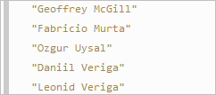
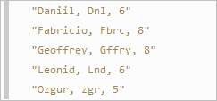
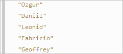
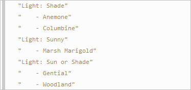

# LINQ Support

Bridge fully supports **LINQ** queries, the **IEnumerable** interface and the **Enumerable** class. LINQ query operators are defined as extension methods but the comprehension query syntax is also supported. The related namespaces are `System.Linq` and `System.Collections.Generic`.

Here are a few basic samples to get started.

## Getting Started

The following example filters the names containing the character `"i"`, sorts them in ascending alphabetical order and outputs the resulting sequence in upper case.

```csharp Example ([Deck.NET](https://deck.net/872d7fd3df808e0de041ea6fd95f3352))
public class App
{
    public static void Main()
    {
        string[] names = { "Roger", "Bridget", "Cortney", "Lee", "Winston" };
        IEnumerable<string> query = names
            .Where(n => n.Contains("i"))
            .OrderBy(n => n)
            .Select(n => n.ToUpperCase());

        foreach (string q in query)
        {
            Console.WriteLine(q);
        }
    }
}
```

Here is the same example expressed in comprehension syntax:

```csharp Example ([Deck.NET](https://deck.net/42d5372b89b97fa58499c55541a89cbc))
public class App
{
    public static void Main()
    {
        string[] names = { "Roger", "Bridget", "Cortney", "Lee", "Winston" };
        IEnumerable<string> query =
            from n in names
            where n.Contains("i")
            orderby n
            select n.ToUpper();

        foreach (string q in query)
        {
            Console.WriteLine(q);
        }
    }
}
```

Both LINQ techniques return the same results:

```
BRIDGET
WINSTON
```

## LINQ Flexibility

LINQ queries can be constructed (and used) progressively as the example below demonstrates:

```csharp
public class App
{
    public static void Main()
    {
        List<string> names = new List<string> { "Roger", "Bridget", "Cortney", "Lee", "Winston" };

        var query = names.Where(n => n.Contains("o"));

        var query2 = query.OrderBy(n => n.Length);

        Console.WriteLine("Names with an o: {0}", query2.Count());

        string name = query2.First();

        Console.WriteLine(name);
    }
}
```

The result is:

```
Names with an o: 3
Roger
```

## LINQ Subqueries

This example demonstrates the support of LINQ subqueries. Names are sorted in ascending alphabetical order based on the lastname.

```csharp
public class App
{
    public static void Main()
    {
        string[] names = { 
            "Daniil Veriga", 
            "Fabricio Murta", 
            "Geoffrey McGill", 
            "Leonid Veriga", 
            "Ozgur Uysal"
        };
                    
        var query = names.OrderBy (n => n.Split(" ").Last());

        foreach (string q in query)
        {
            Console.WriteLine(q);
        }
    }
}
```

The output is:



## Complex Types

The following example demonstrates projection into complex types.

```csharp
public class App
{
    public static void Main()
    {
        string[] names = { "Daniil", "Fabricio", "Geoffrey", "Leonid", "Ozgur" };

        var query =
            from n in names
            select new Foo
            {
                Name = n,
                Acronym = n.Replace(new Regex("[aeiou]", "ig"), ""),
                Length = n.Length
            };

        foreach (Foo foo in query)
        {
            Console.WriteLine(foo.ToString());
        }
    }
}

public class Foo
{
    public string Name { get; set; }
    public string Acronym { get; set; }
    public int Length { get; set; }

    public override string ToString()
    {
        return string.Format("{0}, {1}, {2}", this.Name, this.Acronym, this.Length);
    }
}
```

The above code outputs:



## IEnumerable Support

Bridge fully supports the **IEnumerable<T>** interface and its special subtypes. Use of **IOrderedEnumerable** is shown in the example below.

```csharp
public class App
{
    public static void Main()
    {
        string[] names = { "Fabricio", "Geoffrey", "Leonid", "Daniil", "Ozgur" };

        IOrderedEnumerable<string> query1 = names.OrderBy(n => n.Length);

        query1 = query1.ThenBy(n => n);

        foreach (string s in query1)
        {
            Console.WriteLine(s);
        }
    }
}
```

The result is:



## GroupBy

This example groups a list of **Plant** object by the value of the **Light** property.

```csharp
public class App
{
    public static void Main()
    {
        var query = Plants.Flowers.GroupBy(flower => flower.Light);

        foreach (IGrouping<string, Plant> grp in query)
        {
            Console.WriteLine("Light: " + grp.Key);

            foreach (Plant p in grp)
            {
                Console.WriteLine("    - " + p.Common);
            }
        }
    }
}

public class Plant
{
    public string Common { get; set; }
    public string Light { get; set; }
    public bool Indoor { get; set; }
}

public class Plants
{
    public static List<Plant> Flowers
    {
        get
        {
            return new List<Plant>
            {
                new Plant { 
                    Common = "Anemone",
                    Light = "Shade",
                    Indoor = true
                }, 

                new Plant { 
                    Common = "Columbine",
                    Light = "Shade",
                    Indoor = true
                }, 

                new Plant { 
                    Common = "Marsh Marigold",
                    Light = "Sunny",
                    Indoor = false
                }, 

                new Plant { 
                    Common = "Gential",
                    Light = "Sun or Shade",
                    Indoor = false
                }, 

                new Plant { 
                    Common = "Woodland",
                    Light = "Sun or Shade",
                    Indoor = false
                }
            };
        }
    }
}
```

The output is shown below:



The MSDN [101 LINQ Samples article](https://code.msdn.microsoft.com/101-LINQ-Samples-3fb9811b) is a complete catalog of code examples covering the entire range of LINQ functionality and is a great place to start from if you would like to learn how to use LINQ in your applications. We have already successfully tested all these examples with Bridge. The related unit tests are available to run and view the results in the [online Bridge Test Library](https://testing.bridge.net/?module=LINQ).