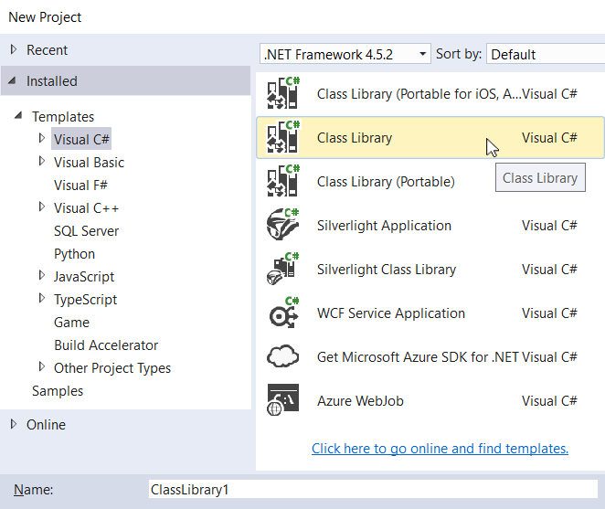
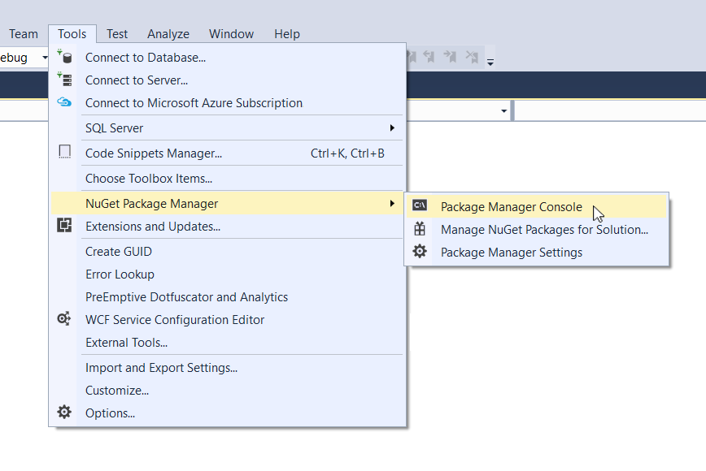

# NuGet Installation

To make a clean project with Bridge NuGet packages, start by creating a new **C# Class Library** project. This article will describe the steps necessary to get your project compiling with Bridge.

## Create A New Project

Create a new **C# Class Library Project** such as shown below:



## Install NuGet Package

To turn the newly created project into a **Bridge.NET** project, open either the NuGet **Package Manager Console** or **Package Manager Dialog**.

Open NuGet's console via <kbd>Tools</kbd> > <kbd>NuGet Package Manager</kbd> > <kbd>Package Manager Console</kbd>.



Once the console is open, install Bridge by running the following command:

```
Install-Package Bridge
```

At this point, the project's references will be replaced with **Bridge** and **Bridge.Html5**. This is the expected behaviour of a successfull Bridge.NET installation. Additionally, **Bridge.jQuery2** and **Bridge.Bootstrap3** would be in place if the respective packages were installed as well.

## Additional Frameworks

You can also install additional JavaScript framework support using the same technique. For example, **Bridge.Bootstrap** will install the [Twitter Bootstrap](https://getbootstrap.com/) C# bindings, as well as **Bridge.jQuery** since [jQuery](https://jquery.com) is a dependency of Bootstrap.

## Build The Project

You now have a Class Library project that is configured to use Bridge and can compile your C# into JavaScript. You will find the following files in the `Bridge\output` folder as soon as you Build the project (F6):

* `bridge.js`
* `bridge.min.js`
* `ClassLibrary1.js`
* `ClassLibrary1.min.js`

The two latter files are assuming the project name is `ClassLibrary1`. By default, these two files will be created with your projects Namespace name.